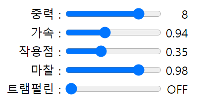
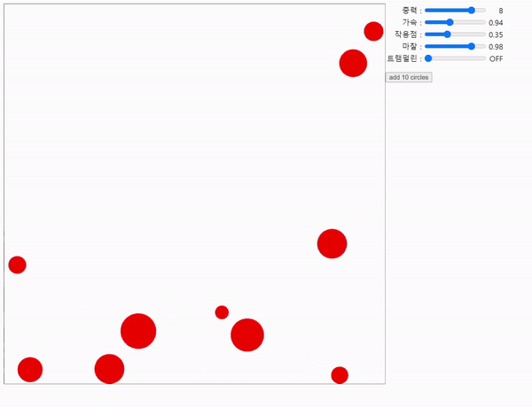

# 공 튀기기 예제

7주차에 오프라인 모임을 가졌습니다. 이전 시간에 배운 걸 정리하고, 실습 예제를 통해 타입스크립트로 코딩해보는 시간을 가졌습니다.

예제의 경우는 멘토님이 자료를 만들어 주셨습니다. [링크](https://dimohy.slogger.today/typescript-7-typescript-canvas)

스터디 시간에 위의 예제에 더해 중력 가속도를 적용해보는 것도 실습해봤습니다.

실습한 파일은 모두 `example` 폴더에 있습니다.

## 실습 내용

여러 파라미터를 사용해서 중력 작용과 최대한 유사하게 작동하도록 만들어봤습니다.



- 중력: 아래 방향으로 가해지는 기본 중력입니다. 수치가 높을 수록 빠르게 떨어집니다.
- 가속: 위에서 아래로 떨어질 때 더해지는 가변 속도입니다. 위로 올라가면 가속도가 줄어들고, 내려갈 때 가속도가 늘어납니다. 수치가 낮을 수록 빨리 떨어집니다.
- 작용점: 가속이 더해지는 지점입니다. 수치가 높을 수록 더 빠른 시점부터 가속합니다.
- 마찰: 좌우 움직임에 마찰을 가합니다. 수치가 낮을 수록 빨리 멈춥니다.
- 트램펄린: 바닥에 닿아을 때 튕겨줍니다. 심심해서 만들어 봤습니다.

다양한 파라미터를 적절히 조절하면 다음처럼 작동합니다.
[링크](https://plutslet.pe.kr/ball/)를 통해서 실제 동작하는 것도 확인해볼 수 있습니다.



### 컴파일시 코드 비교

타입스크립트로 작성된 코드와 자바스크립트로 컴파일된 코드를 비교해보면, 타입스크립트의 특성이 잘 드러나 있습니다.

<table>

<tr>
<td>

<details>
<summary>타입스크립트</summary>

```tsx
class DrawingApp {
    private canvas: HTMLCanvasElement;
    private context: CanvasRenderingContext2D;

    private readonly circles: Circle[] = [];
    private readonly colors: readonly string[] = ["red", "green", "blue"];
    private colorsCount: number = 0;

    private gravity;    // 중력
    private force;      // 가속
    private minSpeed;   // 작용점
    private friction;   // 마찰
    private trampolin;  // 땅에 닿으면 튕겨내기
    
    constructor(canvas: HTMLCanvasElement) {
        this.canvas = canvas;
        this.context = canvas.getContext("2d");

        this.valueChange();
        this.addCircles(10);

        requestAnimationFrame(this.redraw);
    }

    private redraw = () => {
        this.context.fillStyle = "white";
        this.context.fillRect(0, 0, this.canvas.width, this.canvas.height);

        for(const circle of this.circles) {
            this.drawCircle(circle);
            this.moveCircle(circle);
        }

    requestAnimationFrame(this.redraw);
    }

    private drawCircle (circle: Circle) {
        this.context.fillStyle = circle.color;
        this.context.beginPath();
        this.context.arc(circle.pos.x, circle.pos.y, circle.radius, 0, 2 * Math.PI);
        this.context.fill();
    }

    private getColor(): string {
        let result = this.colors[this.colorsCount];
        this.colorsCount = (this.colorsCount + 1) % this.colors.length;
        return result;
    }

    private moveCircle(circle: Circle) {
        // + 안 붙이면 이상하게 작동합니다.
        let gravity = +this.gravity;
        let force = +this.force;
        let minSpeed = +this.minSpeed;
        let friction = +this.friction;
        let trampolin = +this.trampolin;
        
        circle.pos.x += (circle.pos.xInc * circle.pos.xSpeed);
        circle.pos.y += gravity + (circle.pos.yInc * circle.pos.ySpeed);
        
        // 힘이 작용하는 방향
        // 작용점 보다 현재 가속도가 낮으면 방향 바꿈
        if (circle.pos.ySpeed <= minSpeed) {
            circle.pos.yInc *= -1;
        }

        // 중력가속
        if(circle.pos.yInc <= 0) {
            circle.pos.ySpeed *= force;
        } else {
            circle.pos.ySpeed /= force;
        }

        // 영역
        if (circle.pos.x < 0 || circle.pos.x > this.canvas.width){
            circle.pos.xSpeed *= friction;
            circle.pos.xInc *= -1;
        }
        if (circle.pos.y < circle.radius || circle.pos.y > this.canvas.height - circle.radius) {
            circle.pos.ySpeed *= force * trampolin; 
            circle.pos.xSpeed *= friction;
            circle.pos.yInc *= -1;
        }
        
        // 바닥에서 정지
        if(circle.pos.y > this.canvas.height - circle.radius) {
            circle.pos.y = this.canvas.height - circle.radius;
        }
    }
    
    public valueChange = () => {
        let physics: Physics = {
            gravity: <HTMLInputElement> document.getElementById('gravity'),
            force: <HTMLInputElement> document.getElementById('force'),
            minSpeed: <HTMLInputElement> document.getElementById('minSpeed'),
            friction: <HTMLInputElement> document.getElementById('friction'),
            trampolin: <HTMLInputElement> document.getElementById('trampolin'),
        }
        
        document.getElementsByName("gravity")[0].innerText = this.gravity = physics.gravity.value;
        document.getElementsByName("force")[0].innerText = this.force = physics.force.value;
        document.getElementsByName("minSpeed")[0].innerText = this.minSpeed = physics.minSpeed.value;
        document.getElementsByName("friction")[0].innerText = this.friction = physics.friction.value;
        this.trampolin = physics.trampolin.value;
        document.getElementsByName("trampolin")[0].innerText = this.trampolin == 1 ? "OFF" : "ON";
    };
    
    public addCircles = (numbers: number) => {
        var color = this.getColor();
        this.valueChange();

        for(var i = 0; i < numbers; i++) {
            this.circles.push({
                pos: {
                    x: this.canvas.width * Math.random(),
                    y: this.canvas.height * Math.random(),
                    xInc: (Math.random() > 0.5 ? 1 : -1) * 10 * Math.random() + 1,
                    yInc: 5,
                    xSpeed: 1,
                    ySpeed: 0.98,
                },
                radius: 32 * Math.random() + 8,
                color: color
            })
        }
    }
}

type Circle = {
    pos: Position;
    readonly radius: number;
    readonly color: string;
}

type Position = {
    x: number;
    y: number;
    xInc: number;
    yInc: number;
    xSpeed: number;
    ySpeed: number;
}

type Physics = {
    gravity: HTMLInputElement,
    force: HTMLInputElement,
    minSpeed: HTMLInputElement,
    friction: HTMLInputElement,
    trampolin: HTMLInputElement,
}
```

</details>

</td>
<td>

<details>
<summary>자바스크립트</summary>

```jsx
var DrawingApp = /** @class */ (function () {
    function DrawingApp(canvas) {
        var _this = this;
        this.circles = [];
        this.colors = ["red", "green", "blue"];
        this.colorsCount = 0;
        this.redraw = function () {
            _this.context.fillStyle = "white";
            _this.context.fillRect(0, 0, _this.canvas.width, _this.canvas.height);
            for (var _i = 0, _a = _this.circles; _i < _a.length; _i++) {
                var circle = _a[_i];
                _this.drawCircle(circle);
                _this.moveCircle(circle);
            }
            requestAnimationFrame(_this.redraw);
        };
        this.valueChange = function () {
            var physics = {
                gravity: document.getElementById('gravity'),
                force: document.getElementById('force'),
                minSpeed: document.getElementById('minSpeed'),
                friction: document.getElementById('friction'),
                trampolin: document.getElementById('trampolin'),
            };
            document.getElementsByName("gravity")[0].innerText = _this.gravity = physics.gravity.value;
            document.getElementsByName("force")[0].innerText = _this.force = physics.force.value;
            document.getElementsByName("minSpeed")[0].innerText = _this.minSpeed = physics.minSpeed.value;
            document.getElementsByName("friction")[0].innerText = _this.friction = physics.friction.value;
            _this.trampolin = physics.trampolin.value;
            document.getElementsByName("trampolin")[0].innerText = _this.trampolin == 1 ? "OFF" : "ON";
        };
        this.addCircles = function (numbers) {
            var color = _this.getColor();
            _this.valueChange();
            for (var i = 0; i < numbers; i++) {
                _this.circles.push({
                    pos: {
                        x: _this.canvas.width * Math.random(),
                        y: _this.canvas.height * Math.random(),
                        xInc: (Math.random() > 0.5 ? 1 : -1) * 10 * Math.random() + 1,
                        yInc: 5,
                        xSpeed: 1,
                        ySpeed: 0.98,
                    },
                    radius: 32 * Math.random() + 8,
                    color: color
                });
            }
        };
        this.canvas = canvas;
        this.context = canvas.getContext("2d");
        this.valueChange();
        this.addCircles(10);
        requestAnimationFrame(this.redraw);
    }
    DrawingApp.prototype.drawCircle = function (circle) {
        this.context.fillStyle = circle.color;
        this.context.beginPath();
        this.context.arc(circle.pos.x, circle.pos.y, circle.radius, 0, 2 * Math.PI);
        this.context.fill();
    };
    DrawingApp.prototype.getColor = function () {
        var result = this.colors[this.colorsCount];
        this.colorsCount = (this.colorsCount + 1) % this.colors.length;
        return result;
    };
    DrawingApp.prototype.moveCircle = function (circle) {
        // + 안 붙이면 이상하게 작동합니다.
        var gravity = +this.gravity;
        var force = +this.force;
        var minSpeed = +this.minSpeed;
        var friction = +this.friction;
        var trampolin = +this.trampolin;
        circle.pos.x += (circle.pos.xInc * circle.pos.xSpeed);
        circle.pos.y += gravity + (circle.pos.yInc * circle.pos.ySpeed);
        // 힘이 작용하는 방향
        // 작용점 보다 현재 가속도가 낮으면 방향 바꿈
        if (circle.pos.ySpeed <= minSpeed) {
            circle.pos.yInc *= -1;
        }
        // 중력가속
        if (circle.pos.yInc <= 0) {
            circle.pos.ySpeed *= force;
        }
        else {
            circle.pos.ySpeed /= force;
        }
        // 영역
        if (circle.pos.x < 0 || circle.pos.x > this.canvas.width) {
            circle.pos.xSpeed *= friction;
            circle.pos.xInc *= -1;
        }
        if (circle.pos.y < circle.radius || circle.pos.y > this.canvas.height - circle.radius) {
            circle.pos.ySpeed *= force * trampolin;
            circle.pos.xSpeed *= friction;
            circle.pos.yInc *= -1;
        }
        // 바닥에서 정지
        if (circle.pos.y > this.canvas.height - circle.radius) {
            circle.pos.y = this.canvas.height - circle.radius;
        }
    };
    return DrawingApp;
}());
//# sourceMappingURL=main.js.map
```

</details>

</td>
</tr>

</table>

<br>

## 소감

이번에 타입스크립트를 활용해서 움직이는 걸 처음으로 만들어봤는데, 미리 오류나 실수를 알려줘서 자바스크립트만 사용할 때보다 쉽게 작성한 거 같습니다.

물론 코딩은 오래 걸렸습니다. 공은 잘 튀기는데 중력이니, 가속이니, 마찰까지 신경써야돼서 오래 걸렸던 거 같습니다.

또 타입스크립트의 특성을 많이 활용하지는 못했지만, 자바스크립트에게 굉장히 효과적인 슈퍼셋이라고 느꼈습니다. 특히 정적 검사 시스템이 그렇습니다. 알게 모르게 실수하는 오타 부분은 아주 확실하게 알려줬습니다.

마지막으로 한 마디 덧붙이자면, 저는 이번 실습이 굉장히 재밌었습니다. 감사합니다!
