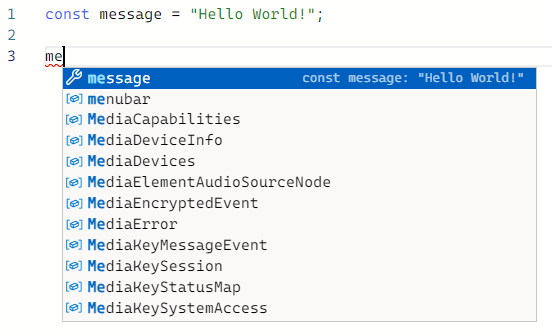

# 타입스크립트 기본

2주차에 학습한 것은 TS Handbook의 Basic입니다.

## 1. 정적 타입 검사 시스템

기본적으로 자바스크립트는 우선 실행부터 해야했다. 오류는 실행하고나서 슬쩍 나타나곤 한다.

대표적으로 undefined다. 실행은 문제없이 되었지만, 분명 예상되는 값이 나와야하는 상황에서 아무것도 나타나지 않는다. 그래서 로그를 확인해보면, undefined! 그리고 코드를 확인해보면, 아뿔싸! 변수 이름이 단 한 글자 틀려있거나 변수 이름을 바꾸고 나서 사용되는 시점에선 바꾸지 않았거나…

이를 미리 확인할 수 있었다면 얼마나 좋을까?

여기서 **타입스크립트**가 등장한다.

타입스크립트에는 정적 타입 검사가 가능하다고 1주차에 언급했다. 해당 타입을 미리 확인하고 코드를 실행하기 전에 예상되는 오류를 미리 알려주는 시스템이다.

여러 예시를 통해 알아보자.

### 정적 타입

첫번째로 살펴볼 건 정적 타입이다.  

</br>

여기에 message라는 변수가 있다. message 안에는 문자열이 담겨있다.

```tsx
const message = "Hello World!";
```

</br>

그리고 여기에 호출 함수가 있다.

```tsx
message.toLowerCase()

message()
```

</br>

위에 나온 두 가지 호출문 중 첫번째는 message 내부의 toLowerCase를 호출하게 될 것이다.

하지만 두번째 호출문은 문자열을 호출하는 함수로 보여진다.

문자열을 호출하라니?

</br>

위와 같은 상황에서 자바스크립트와 타입스크립트는 서로 다르게 작동한다.

</br>

먼저, 자바스크립트의 경우는 실행 시 다음과 같은 오류문을 출력할 것이다. 함수가 아닌 문자열을 호출했기에 나타나는 오류다.

```jsx
TypeError: message is not a function
```

다음으로, 타입스크립트의 경우 실수를 한 시점에서 밑줄과 함께 다음과 같은 문구를 보여줄 것이다.

```tsx
message()
  This expression is not callable.
  Type 'String' has no call signatures.
```

</br>

해당하는 오류를 실수를 한 시점부터 인지했기 때문에 테스트 실행 후 오류를 파악하고 다시 코드를 찾아 수정해야하는 시간을 아낀 것이다!

</br>

다른 예시로 다음과 같은 함수가 정의되어 있다고 하자.

```tsx
function fn(x) {
  return x.flip();
}
```

위의 함수는 x에게 flip이라는 함수가 있다고 가정하고 작성된 것을 알 수 있다.

- 만일 x가 단순 타입(문자열, 숫자, etc…)으로 정의되어 있다면?
- 만일 x가 여러 함수를 가지고 있지만, 해당하는 flip 함수를 가지고 있지 않다면?

자바스크립트는 실행후 오류를 출력할 것이고, 타입스크립트는 해당 오류를 미리 알려줄 것이다.  

`타입스크립트: 그 함수, 없을 수도 있으니까 확인해봐.`

### 코드 오류

두번째로 살펴볼 건 코드 오류다.

</br>

여기 객체 하나가 있다.

```tsx
const user = {
  name: "Daniel",
  age: 26,
};
```

그리고 아래의 변수를 호출했다고 하자.

```tsx
user.location;
```

자바스크립트라면 일단 실행시키고  undefined를 반환할 것이다.

</br>

하지만 타입스크립트라면?
다음처럼 오류를 미리 알려줄 것이다.

```tsx
Property 'location' does not exist on type '{ name: string; age: number; }'.
```

해당하는 user 객체에 location이라는 변수가 없다고 말이다.

</br>

다른 예로, 위에 있던 호출어를 다시 보자.  
  
```jsx
message.toLowerCase()
```

위의 함수를 실행하면 문자열이 모두 소문자로 출력될 것이다.

</br>

그럼 다음과 같은 경우엔?

```jsx
message.toLowercase()
message.toLowarCase()
```

</br>

타입스크립트라면 오타가 발생한 시점에서 친절히 알려줄 것이다. 그리고 원래 사용하려 했던 함수까지 함께 알려준다.

```jsx
 Property 'toLowercase' does not exist on type 'string'. Did you mean 'toLowerCase'?
 Property 'toLowarCase' does not exist on type 'string'. Did you mean 'toLowerCase'?
```

</br>

이런 예시도 있다.

다음의 동전 던지기 함수를 보자.

```jsx
function flipCoin(){
    return Math.random < 0.5;
}
```

</br>

무언가 잘못된 부분이 있는 것 같다. 랜덤 함수에 괄호가 없는 것 같은데…

```tsx
Operator '<' cannot be applied to types '() => number' and 'number'.
```

아하! 타입스크립트가 오류를 찾아냈다.

</br>

이외에 논리적인 오류를 찾아낼 수 있다.

다음의 예시를 통해 보자.

```tsx
const value = Math.random() < 0.5 ? "a" : "b";

if(value !== "a"){
 // ...
} else if(value === "b"){
 // ...
}
```

</br>

위에서 선언된 조건으로 a 혹은 b가 리턴되고,

if 문을 들어와서 a가 아닐 때 즉, b 일때 실행되고,

a일 때는 else if 문으로 들어가서 비교를 하니,

a는 b가 아니니까…

</br>

잠깐, a일 때는 항상 false가 되는 거 같은데?

</br>

이를 미리 감지한 타입스크립트는 아래의 오류를 알려준다.

```tsx
This condition will always return 'false' since the types '"a"' and '"b"' have no overlap.
```

### 명시적 타입

타입스크립트에선 타입을 미리 지정할 수 있다.

</br>

```tsx
var message: string;
```

이제 message는 문자열만 받아들이게 되었다. 만약 다른 타입의 자료를 대입시킨다면 어떻게 될까?

```tsx
message = 16
Type 'number' is not assignable to type 'string'.
```

위와 같은 오류를 알려준다.

</br>

이는 함수에도 동일하게 적용된다.

다음을 보면 인자로 오는 변수에 타입을 지정해두었다.

```tsx
function greet(person: string, date: string) {
  console.log(`Hello ${person}, today is ${date}!`);
}
```

</br>

이를 다음과 같이 호출 했다고 하면,

```tsx
greet("Brendan", 16);
Argument of type 'number' is not assignable to parameter of type 'string'.
```

위의 예시와 동일하게 숫자는 문자열에 올 수 없다고 알려준다.

</br>

그런데 처음 선언할 때 임의의 값을 대입한 상황에서는 어떻게 될까?

```tsx
var message = "Hello world!";

message = 16;
Type 'number' is not assignable to type 'string'.
```

아하, 선언할 때 문자열로 지정이 되는 구나.

### 타이핑 도구

타입스크립트는 우리가 저지를 여러 오타들을 예방하기위해 한 가지 도구를 도입했다.

그것이 바로 ‘자동 완성’이다.

이 도구를 이용하면 다음처럼 작성할 코드를 자동으로 완성시켜준다.



</br>

편하게 `Tab` 키만 누르자.

### 검사기의 엄격도

타입스크립트의 검사기는 기본적으로 모든 규칙을 사용하도록 설정되었다. 하지만 원하지 않은 규칙이 있다면 사용자의 임의대로 규칙을 켜고 끌 수 있다. 예를 들어 null 값이나 undefined 값의 대한 검사를 원하지 않으면 얼마든지 해당 규칙을 끄면 된다.

## 2. 타입스크립트 컴파일러

타입스크립트 파일은 `.ts` 형식의 확장자를 가진다. 이를 그대로 사용할 순 없고, 자바스크립트로 파일을 변환해야한다. 이때 `tsc` 명령이 필요하다.

하지만 `tsc` 명령을 사용하기 위해서는 node.js와 typescrit가 설치되어 있어야한다.

</br>

설치과정은 간단하다.

[Node.js 공식 홈페이지](https://nodejs.org/ko/)에서 자신이 원하는 버전을 다운받아 설치한 다음,

콘솔창을 열어 `npm install -g typescript`  명령을 입력해 Typescript를 설치한다.

이제 `tsc` 명령어를 사용할 수 있게 된다.

</br>

그럼, 명령어에 대해 알아보자.

콘솔창에 `tsc 파일이름.ts` 라고 명령을 내리면 해당 파일이 자바스크립트로 변환이 되고, `.js` 의 확장자를 가진 파일을 새로 만들어줄 것이다.

이때 오류가 발생해도 파일은 정상적으로 생성된다.

잠깐, ‘정상적’으로?

</br>

타입스크립트는 정적으로 검사만 진행할 뿐이지 실행할 때 관여하지 않는다. 즉, 여러 오류가 발생해도 ‘실행은’ 시킬 수 있다. 컴파일에도 마찬가지다. 파일을 정상적으로 생성한 것 뿐이다.

이때 사용할 수 있는 명령이 있다.

`tsc --noEmitOnError 파일이름.ts`

위 명령을 이용하면 오류가 발생할 때 파일을 생성하지 않는다. 정적 검사 시 나타난 오류를 컴파일 시에도 동일하게 적용하는 것이다.

</br>

추가로, 타입스크립트로 작성된 파일은 명시적으로 표현된 모든 타입을 제거하여 컴파일 하게 된다.

```tsx
function greet(person: string, date: string) {
  console.log(`Hello ${person}, today is ${date}!`);
}
```

위의 코드를 컴파일 하게 되면, 아래와 같이 변환되는 것이다.

```tsx
function greet(person, date) {
    console.log("Hello ".concat(person, ", today is ").concat(date, "!"));
}
```

</br>

뭔가 많이 바뀌었다.

</br>

이렇게 템플릿 문자열도 평범해진 이유는 다운레벨링이라는 기능 때문이라고 한다.

상위 버전에서 작성된 것을 하위 버전으로 바꿔주는 기능이라고 하는데, 변환되는 기본 버전이 아주 구버전인 ES3으로 지정되어 있기 때문에 출력부분이 바뀌어있는 것이다.

</br>

이를 기존에 작성한 것처럼 템플릿 문자열을 이용하려면 컴파일 버전을 지정해줘야하는데, ECMAScript 2015라고 불리는 버전으로 지정하면 된다.

플래그는 `--target 원하는버전`  으로 이용하면 된다.

위의 언급한 버전은 `es2015` 이고, `tsc --target es2015 파일이름.ts` 이런 명령을 주면 다음과 같이 타입만 제거된 상태로 변환될 것이다.

```jsx
function greet(person, date) {
    console.log(`Hello ${person}, today is ${date}!`);
}
```
