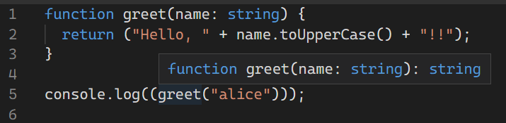
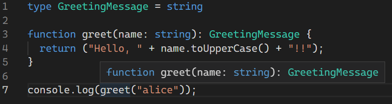
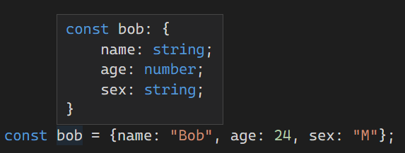
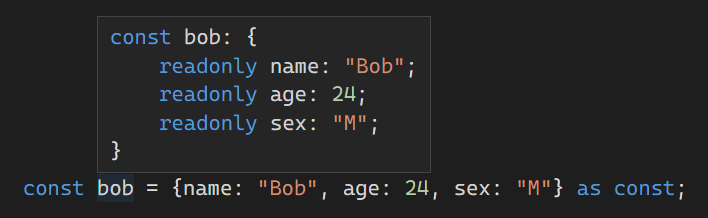

# 타입들

3주차는 Handbook의 Everyday Types에 해당하는 내용을 학습했습니다. 타입스크립트에서 사용 가능한 타입이 주된 내용입니다.

## 원시 타입

자바스크립트에서 주로 사용되는 세 가지 원시 타입이 있다.

그것은 각각 문자열(string), 숫자(number), 논리(boolean) 타입이다.

- `string`: `“Hello world”` 같은 문자열을 담을 수 있다.
- `number`: `42` 같은 숫자를 담을 수 있다. 자바스크립트에선 정수와 실수를 구분하지 않기 때문에 숫자는 모두 number로 표현된다.
- `boolean`: `true` 와 `false` 라는 두 가지 값만을 담을 수 있다. 이는 논리 연산에 사용된다.

<br>

## 배열

어떤 타입을 배열로 담아 사용하고 싶을 때 `타입[]` 과 같은 형태로 사용할 수 있다. 예를 들어, `[1, 2, 3]`과 같이 숫자를 배열로 담아야 할 때 `number[]` 와 같이 사용하는 식이다.

이는 `Array<타입>` 과 같은 형태로도 사용할 수 있고, 위와 동일하게 작동한다.  

<br>

## 변수와 타입 표기

`const`, `var`, `let` 등으로 변수를 선언할 때에도 타입을 미리 지정할 수 있다. 이는 선택적인 부분이다.

```tsx
let myName1: string = "Alice";

let myName2 = "Alice";
```

위에 `myName1` 처럼 타입을 표기해도 되지만, `myName2` 와 같이 초기값을 지정해두는 경우엔 따로 지정하지 않아도 해당 값에 맞춰 타입이 정해진다.

<br>

## 함수

타입스크립트는 함수에서 데이터를 주고 받을 때 입력과 출력의 타입을 지정할 수 있다.

### 매개변수 타입 표기

여기 입력한 이름으로 인사하는 함수가 하나 있다. 이때 이름은 항상 문자열로 입력 받게 지정할 수 있다.

```tsx
function greet(name: string) {
  console.log("Hello, " + name.toUpperCase() + "!!");
}

greet("alice");
greet(42);
Argument of type 'number' is not assignable to parameter of type 'string'.
```

매개변수에 타입이 지정되어 있기 때문에 `alice`에게 인사할 때는 문제가 없지만, 이후 숫자 `42` 가 입력되었을 때는 위처럼 검사를 통해 오류를 도출한다.

### 반환 타입 표기

반환되는 타입도 명시할 수 있다. 

```tsx
function greet(name: string): string {
  return ("Hello, " + name.toUpperCase() + "!!");
}

console.log(greet("alice"));
```

하지만 표기하지 않더라도 타입스크립트는 알아서 추론한다. 위처럼 반환 타입을 명시하지 않아도 아래와 같이 반환 타입이 지정된다는 걸 알 수 있다.



이처럼 반환 타입을 표기하지 않아도 타입스크립트가 `return` 문을 바탕으로 반환 타입을 추론하기 때문에 표기 하지 않아도 된다. 

즉, 가독성, 문서화, 코드의 잘못된 수정 방지, 지극히 개인적인 선호 등 여러가지 이유에 맞게 반환 타입을 표기하면 된다.

### 익명함수

함수가 코드 상에 위치한 곳에서 어떻게 호출되는 지를 알아낼 수 있다면, 타입스크립트는 매개변수에 자동으로 타입을 지정한다.

```tsx
const names = ["Alice", "Bob", "Eve"];

names.forEach(function (s) {
  console.log(s.toUppercase());
Property 'toUppercase' does not exist on type 'string'. Did you mean 'toUpperCase'?
});
```

익명함수에 매개변수가 `string` 타입인 것을 검사를 통해 추론하여 해당 오타를 찾아낼 수 있었다.

이는 화살표 함수에도 적용된다.

```tsx
const numbers = [1,2,3];

numbers.forEach((n) => {
  console.log(n.toUpperCase());
Property 'toUpperCase' does not exist on type 'number'.
});
```

매개 변수가 숫자 타입이라고 추론하여 오류를 감지한 것을 확인할 수 있다.

이러한 과정을 문맥적 타입 부여라고 부른다. 함수가 실행되는 문맥을 통해 해당 함수가 가져야하는 타입을 추론하기 때문이다.

<br>

## 객체 타입

객체는 프로퍼티를 가지는 타입을 말하는데, 대부분의 경우가 객체에 해당한다. 객체 타입을 정의하려면, 해당 객체의 프로퍼티들과 각 타입을 나열하면 된다.

```tsx
function printCoord(pt: { x: number; y: number }) {
  console.log("The coordinate's x value is " + pt.x);
  console.log("The coordinate's y value is " + pt.y);
}

printCoord({ x: 3, y: 7 });
```

위에서 매개변수는 `x`와 `y` 라는 두 프로퍼티로 이루어진 타입으로 표기되어 있고, 두 값은 모두 `number` 타입을 가지고 있다.

이런 매개변수를 구분할 때 `,` 와 `;` 를 사용할 수 있고, 가장 마지막에도 구분자를 선택적으로 표기할 수 있다.

```tsx
function printCoord(pt: { x: number, y: number; }) {};
```

또한 각 프로퍼티의 타입 표기도 선택 사항이다. 타입을 표기하지 않는다면 모든 타입 `any` 로 간주된다.

### 옵셔널 프로퍼티

객체의 프로퍼티를 필수가 아닌 선택적으로 타입으로 지정할 수 있다. 프로퍼티 뒤에 `?`를 붙이면 되는데, 이를 선택적인 타입, 옵셔널이라고 부른다.

```tsx
function printName(obj: { first: string; last?: string }) {
	console.log(obj.first.toUpperCase() + " " + obj.last.toUpperCase());
}

printName({ first: "Bob" });
```

위의 함수를 호출하는 두 구문 모두 호출은 가능하다. 하지만 함수가 실행되면 `last` 의 값이 `undefined` 이기 때문에 프로그램이 멈추게 된다. 이를 해결하기 위해 `undefined` 여부를 확인해야한다.

```tsx
if (obj.last !== undefined) {
  console.log(obj.last.toUpperCase());
}
```

또는 아래와 같이 사용할 수도 있다. 옵셔널 프로퍼티와 동일하게 변수를 이용하는 부분에 `?` 를 붙이는 방법이다. 이는 최신 자바스크립트 문법으로 프로그램 실행은 문제없이 가능하나, 출력시 `undefined` 를 출력하게 된다.

```tsx
console.log(obj.first.toUpperCase() + " " + obj.last?.toUpperCase());
```

<br>

## 유니언 타입

타입스크립트는 기존 타입과 다양한 연산자를 사용해 새로운 타입을 만들 수 있다.

### 유니언 타입 정의하기

유니언 타입은 서로 다른 두 개의 타입을 사용하여 만드는 것이다. 타입의 값은 타입 조합에 사용된 타입 중 하나를 가질 수 있고, 조합에 사용된 각 타입을 유니언 타입의 맴버라고 부른다.

아래의 예시처럼 사람의 나이를 문자열, 숫자, 객체 상관 없이 입력받은 것을 확인할 수 있다.

```tsx
function printName(person: { name: string; age: string | number }) {
  console.log(person.name.toUpperCase() + " is " + person.age);
}

printName({ name: "Bob", age: 25 });
printName({ name: "alice", age: "21" });
printName({ name: "Josh", age: {n: 27} });
Type '{ age: number; }' is not assignable to type 'string | number'.
```

추가로 객체 형태의 유니언도 가능하다.

```tsx
function printName(person: { name: string; age: {n: number | string }}) {
  console.log(person.name.toUpperCase() + " is " + person.age.n);
}

printName({ name: "Josh", age: {n: 27} });
printName({ name: "amanda", age: {n: "36"} });
```

### 유니언 타입 사용하기

위에서는 출력하는데 아무런 문제가 없었지만, 두가지 타입을 다르게 사용해야할 때도 있을 것이다.

예를들어 위의 두 예시를 하나로 합쳐보면 어떨까?

```tsx
function printName(person: { name: string; age: string | number | {n: number | string } }) {
  console.log(person.name.toUpperCase() + " is " + person.age);
}

printName({ name: "Bob", age: 25 });
printName({ name: "alice", age: "21" });
printName({ name: "Josh", age: {n: 27} });
```

`Bob` 과 `alice` 는 제대로 출력하지만 `Josh` 의 나이는 이상하게 출력할 것이다.

또 다른 예시가 있다.

```tsx
function printId(id: number | string) {
  console.log(id.toUpperCase());
}
Property 'toUpperCase' does not exist on type 'string | number'.
  Property 'toUpperCase' does not exist on type 'number'.
```

첫번째 예시와는 달리 오류 문구까지 나타난다. 이를 해결하기 위해서 유니언을 좁혀야한다.

```tsx
function printName(person: { name: string; age: string | number | {n: number | string } }) {
  if(typeof person.age === "object"){
    person.age = person.age.n
  }
  console.log(person.name.toUpperCase() + " is " + person.age);
}
```

```tsx
function printId(id: number | string) {
  if (typeof id === "string") { 
    console.log(id.toUpperCase());
  } else {
    console.log(id);
  }
}
```

이런 식으로 특정 타입일 때만 처리하거나 타입에 따라 각기 다른 처리를 하도록 지정해두면 유니언은 좁혀질 것이다.

<br>

## 타입 별칭

똑같은 타입을 한 번 이상 재사용하거나 다른 이름으로 부르고 싶은 경우 타입 별칭을 사용할 수 있다. 타입별칭은 타입을 위한 이름을 제공한다.

```tsx
type Person = {
   name: string;
   age: number;
}

function printName(person: Person) {
  console.log(person.name.toUpperCase() + " is " + person.age);
}
```

타입 별칭은 위의 예시처럼 객체 뿐만 아니라 모든 타입에 새로운 이름을 부여할 수도 있다.

```tsx
type Age = number | string;

type Person = {
   name: string;
   age: Age
}
```

타입 별칭은 단순한 별칭이라서 타입의 다른 이름일 뿐이다. 따라서 별칭으로 지정한 타입은 어디에도 사용 가능하다.



<br>

## 인터페이스

객체를 만들 때 인터페이스를 선언하여 사용할 수도 있다.

```tsx
interface Person {
   name: string;
   age: number;
}

function printName(person: Person) {
  console.log(person.name.toUpperCase() + " is " + person.age);
}
```

타입 별칭으로 객체를 만들었던 것과 유사하게 작성된 걸 확인할 수 있다. 또한 인터페이스는 확장성이 좋기 때문에 타입 별칭 보다 많이 쓰인다.

### 타입 별칭과 인터페이스의 차이점

둘은 매우 비슷하게 작동하기 때문에 자유롭게 선택하여 사용할 수 있다. 가장 큰 차이점으로 타입은 한번 만든 이후에 수정할 수 없지만, 인터페이스는 새로운 프로퍼티를 얼마든지 추가할 수 있다.

<table>

<tr align= "left">
<th width="50%">인터페이스</th>
<th width="50%">타입 별칭</th>
</tr>

<tr>
<td>인터페이스 확장하기</td>
<td>교집합으로 확장하기</td>
</tr>

<tr>
<td>

```tsx
interface Animal {
  name: string
}

interface Bear extends Animal {
  honey: boolean
}

const bear = getBear() 
bear.name
bear.honey

```

</td>
<td>

```tsx
type Animal = {
  name: string
}

type Bear = Animal & { 
  honey: Boolean 
}

const bear = getBear();
bear.name;
bear.honey;

```

</td>
</tr>

<tr>
<td>기존의 인터페이스에 새 필드를 추가하기</td>
<td>타입은 생성된 뒤에는 달라질 수 없다</td>
</tr>

<tr>
<td>

```tsx
interface Window {
  title: string
}

interface Window {
  ts: TypeScriptAPI
}

const src = 'const a = "Hello World"';
window.ts.transpileModule(src, {});

```

</td>
<td>

```tsx
type Window = {
  title: string
}

type Window = {
  ts: TypeScriptAPI
}

 // Error: Duplicate identifier 'Window'.


```

</td>
</tr>

</table>

대부분 개인이 선호하는 방법으로 사용하게 되겠지만, 위의 차이점을 나타낸 표에서 볼 수 있듯이 인터페이스의 확장성이 타입 별칭보다 뛰어나다. 때문에 인터페이스가 타입 별칭 보다는 많이 쓰이는 편이다. 핸드북에서도 나와 있듯, 우선 인터페이스를 사용하고 이후 문제가 발생하였을 때 타입 별칭을 사용하라고 한다.

<br>

## 타입 단언

코드를 작성하다 보면 결과값이 어떤 정보를 가질 지 알고 있지만, 타입스크립트가 모르는 경우가 생긴다. `document.getElementById` 를 사용하는 경우, HTML 코드를 확인한 우리는 반환되는 정보를 확실하게 알고 있다. 하지만 타입스크립트는 무언가 반환된다는 것만 알고 자세한 것은 모르게 된다.

타입 단언은 타입을 좀 더 구체적으로 명시할 수 있다.

```tsx
const myCanvas = document.getElementById("main_canvas") as HTMLCanvasElement;

const myCanvas = <HTMLCanvasElement>document.getElementById("main_canvas");
```

두 가지 방식으로 타입 단언을 사용할 수 있는데, 타입 단언을 사용해도 컴파일 시에 제거되며 코드 작성 중에만 명시하게 된다. 따라서 타입 단언을 잘못 적어두었더라도 프로그램을 실행했을 때에 아무런 문제가 없을 수 있다.

타입 단언을 사용하는 이유는 코드 작성 중 예기지 않은 문제를 방지하기 위해서다.

```tsx
const x = "hello" as number;
Conversion of type 'string' to type 'number' may be a mistake because neither type sufficiently overlaps with the other. If this was intentional, convert the expression to 'unknown' first.
```

위의 예시처럼 얼토당토 않은, 불가능한 오류가 발생하지 않도록 막아주는 것이다.

<br>

## 리터럴 타입

한번 지정한 값만 가질 수 있는 것, 상수와 같은 값을 리터럴 값이라고 하는데, 이를 타입으로 지정하여 사용할 수 있다. `string` 이나 `number` 와 같은 일반적인 타입 말고도, 구체적으로 문자일이나 숫자를 지정할 수 있다는 말이다.

리터럴 타입은 혼자 있을 땐 그렇게 큰 쓸모가 없다. 하지만 유니언과 함께 사용한다면 유용하게 이용된다. 아래의 예시를 보자.

```tsx
interface Person{
   name: string;
   age: number;
   sex: "M" | "W";
}

function printName(person: Person) {
  console.log((person.sex === "M"? "He":"She") + " is " + person.name.toUpperCase() + ", " + person.age + " years old.");
}

printName({name: "Bob", age: 24, sex: "M"})
printName({name: "alice", age: 21, sex: "woman"});
Type '"woman"' is not assignable to type '"M" | "W"'.
```

성별의 값을 `M` 과 `W` 로 명시하여 다른 값이 올 수 없도록 하였다. 이제 코드가 이전보다 명확해졌다.

숫자 리터럴 타입으로 사용하거나,

```tsx
function compare(a: string, b: string): -1 | 0 | 1 {
  return a === b ? 0 : a > b ? 1 : -1;
}
```

리터럴이 아닌 타입과도 함께 사용할 수 있다.

```tsx
interface Options {
  width: number;
}
function configure(x: Options | "auto") {
  // ...
}
configure({ width: 100 });
configure("auto");
configure("automatic");
Argument of type '"automatic"' is not assignable to parameter of type 'Options | "auto"'.
```

이런 리터럴 타입을 보다보니 어딘가 익숙하게 느껴질 거다. 그게 바로 `boolean` 이다. 불 타입은 사실 `true | false`  유니언 타입의 별칭이다.

### 리터럴 추론

객체를 사용하여 변수를 초기화하면 해당 객체의 프로퍼티의 값이 변할 수 있다고 가정한다.

```tsx
declare const someCondition: boolean;
// ---중간 생략---
const obj = { counter: 0 };
if (someCondition) {
  obj.counter = 1;
}
```

위의 예시에서 `counter` 의 값인 `0` 을 `1` 로 바꾸더라도 오류라고 인식하지 않는다. `counter` 이때 `number` 타입으로 간주된 상태다.

동일한 사항이 문자열에도 적용된다. 아래의 예시를 보자.

```tsx
function printName(name: string, age: number, sex: "M" | "W") {
  console.log((sex === "M"? "He":"She") + " is " + name.toUpperCase() + ", " + age + " years old.");
}

const bob = {name: "Bob", age: 24, sex: "M"};

printName(bob.name, bob.age, bob.sex)
Argument of type 'string' is not assignable to parameter of type '"M" | "W"'.
```

`bob` 의 성별이 문자열로 추론되어 오류가 나타난다. 타입스크립트는 `bob` 의 성별이 명확하게 지정되지 않아 `bob`의 정보를 선언한 시점부터 함수를 호출하기 이전까지 `bob` 의 성별이 바뀔 수도 있다고 간주한 것이다.

이를 해결하기 위한 두 가지 방법이 있다.

1. 둘 중 하나에 타입 단언을 추가해 추론 방식을 변경한다.

```tsx
// 선언 시 타입 단언 추가
const bob = {name: "Bob", age: 24, sex: "M" as "M"};
// 호출 시 타입 단언 추가
printName(bob.name, bob.age, bob.sex as "M")
```

선언할 때 추가하면, `bob` 의 성별은 항상 남자라는 것을 의미하며, 이후에도 `bob` 은 남자임을 명시하게 된다.

호출할 때 추가하면, 위에서 무슨 일이 벌어지던 호출 때의 `bob` 의 성별이 남자라는 의미이다.

2. `as const` 를 사용하여 객체 전체를 리터럴 타입으로 변경한다.

```tsx
const bob = {name: "Bob", age: 24, sex: "M"} as const;

printName(bob.name, bob.age, bob.sex)
```

`const` 는 변수를 상수로 만들지만,  `as const` 는 변수가 아닌 변수에 담긴 값 전체가 리터럴 타입으로 만들어진다.

`as const` 비교

<table *width*="80%">

<tr align="center">
<td>

`as const` 미사용

</td>
<td>

`as const` 사용

</td>
</tr>

<tr>
<td></td>
<td></td>
</tr>

</table>

<br>

## `null` 과 `undefined`

자바스크립트에는 빈 값이나 초기화되지 않은 값을 가리키는 두 가지 원시값이 존재한다. 그게 `null` 과 `undefined` 이다.

타입스크립트에서 각 값을 타입으로 지정했고, 해당 타입의 동작 방식을 `strictNullChecks` 옵션을 설정 했는지에 따라 달라진다.

### `strictNullChecks` 설정되지 않았을 때

어떤 값이 `null` 이나 `undefined` 이더라도 해당 값에 평소와 같이 접근 가능해지고, 모든 타입의 변수에 대입될 수 있게 된다.

### `strictNullChecks` 설정되었을 때

어떤 값이 `null` 이나 `undefined` 이 되면, 해당 값을 항상 테스트해야 한다. 아래의 예시처럼 해당 값을 좁히기를 통해 해당 검사를 수행할 수 있다.

```tsx
function doSomething(x: string | undefined) {
  if (x === undefined) {
    // 아무 것도 하지 않는다
  } else {
    console.log("Hello, " + x.toUpperCase());
  }
}
```

Enum의 경우에는 컴파일 시에 필요없는 코드가 남아 자원을 낭비하게 될 수 있다.

### Null 아님 단언 연산자

위에서처럼 명시적인 검사를 진행하지 않고 타입스크립트만의 `null` 과 `undefined` 를 제거하는 구문이 존재한다. 표현식 뒤에 `!` 를 붙이면 해당 값이 `null` 과 `undefined` 가 아니라고 타입 단언하는 것이다. 단, 컴파일 시에 제거되는 구문이므로 해당 값이 반드시 `null` 과 `undefined` 가 아닐 때에 사용해야한다.

```tsx
function liveDangerously(x?: number | undefined) {
  // 오류 없음
  console.log(x!.toFixed());
}
```

### 열거형

열거형은 타입스크립트가 자바스크립트에 추가하는 기능으로, 다른 언어에서 사용해봤을 타입이다. 아래와 같은 식으로 작성하게 된다.

```tsx
enum Direction {
  Up = 1,
  Down,
  Left,
  Right,
}
```

하지만 열거형은 컴파일 시 코드가 아래와 같이 남게 되므로 꼭 필요할 때만 사용하는 것을 권장하고 있다.

```jsx
var Direction;
(function (Direction) {
    Direction[Direction["Up"] = 1] = "Up";
    Direction[Direction["Down"] = 2] = "Down";
    Direction[Direction["Left"] = 3] = "Left";
    Direction[Direction["Right"] = 4] = "Right";
})(Direction || (Direction = {}));
```

### 자주 사용되지 않는 원시형 타입

#### `bigint`

ES2020 이후, 아주 큰 정수를 다루기 위한 원시 타입이 JavaScript에 추가되었다. 버전이 ES2020 이하라면 `bigint` 타입은 사용할 수 없다.

```tsx
// BigInt 함수를 통하여 bigint 값을 생성
const oneHundred: bigint = BigInt(100);
 
// 리터럴 구문을 통하여 bigint 값을 생성
const anotherHundred: bigint = 100n;
```

#### **`symbol`**

전역적으로 고유한 참조값을 생성하는 데에 사용할 수 있는 원시 타입이다.

```tsx
const firstName = Symbol("name");
const secondName = Symbol("name");
 
if (firstName === secondName) {
This condition will always return 'false' since the types 'typeof firstName' and 'typeof secondName' have no overlap.
}
```
