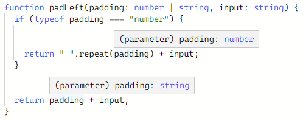
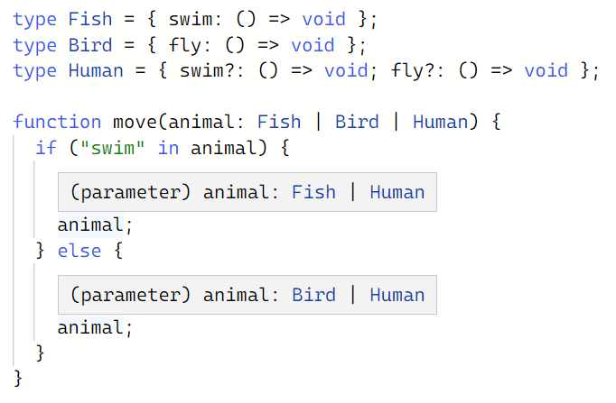
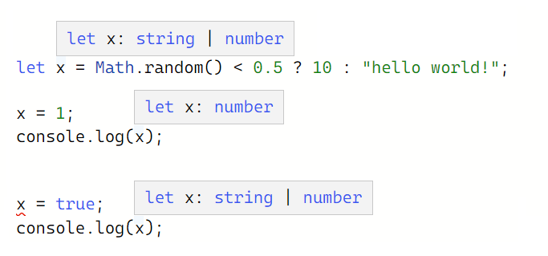
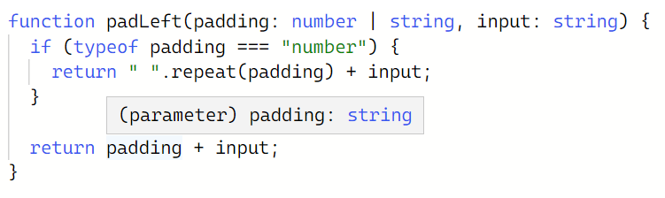
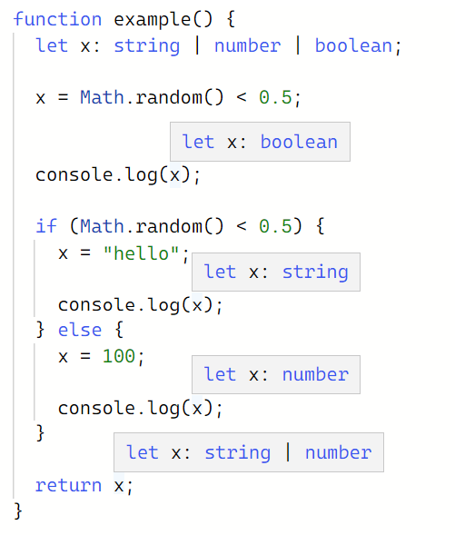
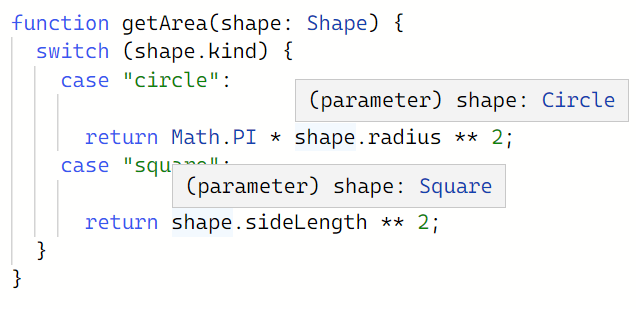

# 좁히기

4주차는 Handbook의 Narrowing에 해당하는 내용을 학습했습니다. 3주차에서 좁히기의 개념이 나온 적 있는데 이번 주차에서 자세하게 다룹니다.

들어가기에 앞서, 멘토 님이 말씀하신 부분이 있습니다.

> 타입스크립트는 오류가 예상되는 부분을 좁히기로 유도하는데, 이렇게 좁혀진 코드가 자바스크립트에서 효과적으로 작동하게 된다는 점이 흥미롭다.

## 좁히기의 개념

아래에 비어있는 함수가 있다. 이함수를 다음의 조건으로 작성한다고 생각해보자.

1. `padding` 이 숫자일 경우 `input` 앞에 `padding` 만큼 공백을 추가한다.
2. `padding` 이 문자열인 경우 `input` 에 패딩만 추가한다.

```tsx
function padLeft(padding: number | string, input: string): string {
  // ...
}
```

여러가지 방안이 떠오를 것이다. 타입스크립트에선 이러한 코드를 작성할 때 예상되는 결과를 감지하고 좁히기를 유도할 것이다.

먼저 숫자일 때의 처리를 작성해보자.

```tsx
function padLeft(padding: number | string, input: string) {
  return " ".repeat(padding) + input;
Argument of type 'string | number' is not assignable to parameter of type 'number'.
  Type 'string' is not assignable to type 'number'.
}
```

타입스크립트는 `padding` 이라는 인자값이 `number | string` 의 유니언 타입과 `string` 타입, 이 두가지 타입이 대입된다고 말하고 있다.

그러면 이제 좁히기를 해보자. `padding` 이 숫자일 때로 좁히는 것이다.

```tsx
function padLeft(padding: number | string, input: string) {
  if (typeof padding === "number") {
    return " ".repeat(padding) + input;
  }
}
```

숫자를 좁혔으니 문자열일 때의 처리도 추가하자.

코드를 작성하고 확인해보니 `padding` 의 타입이 해당 처리에 맞게 결정된 것을 확인할 수 있을 것이다.



이것이 좁히기의 개념이다. 타입스크립트의 가이드를 따라서 코드를 작성하고 보니 해당 타입만 처리되는 휼륭한 코드가 작성된 것이다.

<br>

## `typeof` 의 타입 가드들

자바스크립트가 제공하는 연산자 `typeof` 는 해당 값이 어떤 타입을 가지고 있는지를 문자열 형태로 반환해준다. 반환되는 타입은 아래와 같다.

- `"string"`
- `"number"`
- `"bigint"`
- `"boolean"`
- `"symbol"`
- `"undefined"`
- `"object"`
- `"function"`

`typeof` 는 자바스크립트에서 자주 사용된다. 위에 예시에서도, 심지어 3주차에서도 나올 정도다. 하지만 안타깝게도 타입 가드가 모든 타입을 반환하지는 않는다. 예를 들어, `null` 타입은 `typeof` 를 사용했을 때 단순히 `object` 로 반환된다. 아래의 예시를 통해 보자.

```tsx
function printAll(strs: string | string[] | null) {
  if (typeof strs === "object") {
    for (const s of strs) {
Object is possibly 'null'.
      console.log(s);
    }
  } else if (typeof strs === "string") {
    console.log(strs);
  }
}
```

`strs`에 문자열과 문자 배열 뿐만아니라 `null` 타입도 올 수 있다고 명시해뒀다. 그리고 `typeof strs` 가 `object` 일 때만 처리하는 구문을 작성했을 때 타입스크립트는 `null` 이 올 수 있음을 알려준다.

즉, `typeof strs === "object"` 에서 `strs` 가 단순하게 `string[]` 로 좁혀진 것이 아니라 `string[] | null` 좁혀졌다는 것이다.

이를 올바르게 처리위해선 다음의 진실성 좁히기를 알아야한다.

<br>

## 진실성 좁히기(**Truthiness narrowing)**

자바스크립트에서 `&&`, `||,` `if` 문, 논리 부정 (`!`) 등 어떤 식으로도 조건식을 표현할 수 있다. 또한 `if` 문 조건이 항상 `boolean` 일 거라고 생각하지 않는다.

다음의 예시를 보자.

```tsx
function getUsersOnlineMessage(numUsersOnline: number) {
  if (numUsersOnline) {
    return `There are ${numUsersOnline} online now!`;
  }
  return "Nobody's here. :(";
}
```

자바스크립트는 `if` 문의 조건식을 강제로  `boolean` 타입으로 만든 다음 그것이 거짓인지 참인지를 판단한다. 조건식은 앞서 말했듯이 모든 값이 올 수 있는데, 거짓을 제외한 나머지 값을 참으로 판단한다. 이때 거짓인 값은 다음과 같다.

- `0`
- `NaN`
- `""` (빈 문자열)
- `0n` (`bigint` 타입의 0)
- `null`
- `undefined`

또한 `Boolean` 함수나 두 개의 논리 부정 (`!!`) 을 사용하면 값을 항상 논리 타입으로 강제할 수 있다.

```tsx
Boolean("hello");
!!"world";
```

두 값 모두 참으로 판단하지만 `Boolean` 함수와 `!!` 는 서로 다르게 작동한다.

`Boolean` 함수의 경우, 해당 값을 `boolean` 타입으로 지정한다.

`!!` 의 경우, 참인지 거짓따라 해당하는 값을 타입으로 지정한다. 위의 경우 참으로 판단하여 `true` 타입으로 지정된다.

이런 자바스크립트의 특성을 진실성 좁히기에 사용할 수 있다. 위에서 작성된 코드를 수정해보자.

```tsx
function printAll(strs: string | string[] | null) {
  if (strs && typeof strs === "object") {
    for (const s of strs) {
      console.log(s);
    }
  } else if (typeof strs === "string") {
    console.log(strs);
  }
}
```

처음 `if` 문에 `strs &&` 가 추가 되었다. 이때 `strs` 가 `null` 이라면 해당 `if` 문은 `false` 가 되는 셈이다. 이제 `strs` 가 `null` 일 때 올 수 있는 다음과 같은 오류는 해결되었다.

```tsx
TypeError: null is not iterable
```

그렇다면 `null` 값을 먼저 확인하게 되면 어떻게 될까?

```tsx
function printAll(strs: string | string[] | null) {
  if (strs) {
    if (typeof strs === "object") {
      for (const s of strs) {
        console.log(s);
      }
    } else if (typeof strs === "string") {
      console.log(strs);
    }
  }
}
```

위의 예시도 잘 작동할 것이다. 하지만 처음 조건문에서 `null` 값만 제외하는 것이 아니라 빈 문자열 `“”` 도 아예 제외된다는 걸 알아둬야 한다. 만일 `null` 만 제외시키고, 빈 문자열을 활용하는 것이 목표 시스템이라면 이는 지양해야하는 것이다.

<br>

## 동등성 좁히기(**Equality narrowing)**

타입스크립트는 `switch` 문과 `===` , `!==` , `==` , `!=` 같은 동등성 검사를 이용해서 타입을 좁힐 수 있다.

```tsx
function example(x: string | number, y: string | boolean) {
  if (x === y) {
    x.toUpperCase();
    y.toLowerCase();
  } else {
    console.log(x);
    console.log(y);
  }
}
```

위의 예시를 보면 조건문은 `x` 와 `y` 가 값은 물론 타입까지 같은 경우를 조건으로 들고 있다. `x` 는 `string | number` 의 유니언 타입이고, `y` 는 `string | boolean` 의 유니언 타입이다.

그렇다면 이 둘이 같을 때는 언제일까?

`x` 와 `y` 모두 `string` 타입의 같은 값을 가졌을 때고, 이는 `string` 타입으로 좁혀졌다는 의미가 된다. 그렇기 때문에 `string` 타입만 가능한 `toUpperCase` 함수를 사용해도 오류가 나오지 않게 되는 것이다.

<br>

## **`in` 연산자로 좁히기**

자바스크립트에 `in` 연산자기 있다. 객체가 해당 속성이 있는지 확인하는 연산자다. 타입스크립트에서 `in` 연산자를 좁히기에 이용할 수 있다.

```tsx
type Fish = { swim: () => void };
type Bird = { fly: () => void };

function move(animal: Fish | Bird) {
  if ("swim" in animal) {
    return animal.swim();
  }
 
  return animal.fly();
}
```

위의 예시를 보면 이해가 될 것이다. `animal` 이 `Fish | Bird` 의 유니언 타입이라 `swim` 과 `fly` , 두 가지를 속성으로 가질 수 있다. 이때 `in` 연산자를 사용해 `animal` 이 `swim` 을 가지고 있는 경우로 좁히는 것이다.

두 가지 모두 해당하는 경우도 있을 것이다. 이럴 때에는 `in` 연산자로 좁히더라도 양쪽 모두에 속할 수 있다.



<br>

## **`instanceof` 로 좁히기**

자바스크립트는 어떤 값이 다른 값의 인스턴트인지 확인 하는 `instanceof` 연산자를 가지고 있다.

```tsx
function logValue(x: Date | string) {
  if (x instanceof Date) {
    console.log(x.toUTCString());
  } else {
    console.log(x.toUpperCase());
  }
}
```

예시에 `x` 가 `Date` 에 속해 있는지를 판단하는 조건이 있고, 이를 통해 좁혀진 것을 확인할 수 있다.

`instanceof` 의 경우 `typeof` 와 달리 타입이 아닌 객체를 판단하고, `true` 와 `false` 를 반환한다.

<br>

### ※ 간단하게 정리해본 연산자 비교표 ※

| 연산자 | 대상 | 사용 예시 | 반환값 |
| --- | --- | --- | --- |
| `typeof`  | 타입 | `typeof x === "type"` | `string` |
| `in` | 객체 속성 | `“value” in x` | `boolean` |
| `instanceof` | 객체 | `x instanseof Foo` | `boolean` |

<br>

## 할당들(**Assignments)**

자바스크립트에서 변수는 기본적으로 `any` 타입으로 할당한다. 하지만 타입스크립트는 변수에 값을 할당할 때 오른쪽부터 왼쪽으로 범위를 적절하게 좁힌다. 그렇게 좁혀진 타입을 이후에 재할당하지 않도록 권고한다.

```tsx
let x = Math.random() < 0.5 ? 10 : "hello world!";
```

이때 `x` 의 타입은 `number | string` 타입과 같아진다.

때문에 `x` 에 같은 타입의 값을 대입할 수는 있지만, 새로운 타입으로 재할당하려 할때 다음과 같은 오류를 보여줄 것이다.

```tsx
x = 1;

x = true;
Type 'boolean' is not assignable to type 'string | number'.
```

또한 실제 사용하는 부분에서도 차이가 있다. 숫자를 대입한 부분은 타입이 `number` 로 바뀐 것을 확인할 수 있지만,  `true` 를 대입했을 때는 `boolean` 타입으로 바뀌지 않고 기존 타입 `number | string` 인 것을 확인할 수 있다.



<br>

## 제어 흐름 분석(**Control flow analysis)**

 위의 코드를 다시 가져와보면, 반환문을 굳이 `else` 로 묶지 않아도 `padding` 의 타입이 `string` 으로 좁혀된 것을 볼 수 있다.



위에서 좁혀지고 남은 타입이 `string` 뿐이라서 그 흐름대로 좁힌 것이다. 이렇게 흐름에 따라 코드를 분석하는 것이 **제어 흐름 분석**이라고 부른다.

타입스크립트가 타입을 상황에 맞게 할당할 수 있는 이유가 이 제어 흐름 분석 때문이다.

다음의 예시를 보면 쉽게 이해할 수 있을 것이다.



<br>

## 타입 서술어 사용(Using type predicates)

위의 예시는 모두 자바스크립트에서 제공하는 기능을 사용한 것이다. 또한 여러 분기와 조건으로 이용하여 타입들을 좁혔다. 하지만 타입의 변화를 코드 전체에서 직접 제어할 수도 있다. 타입 서술어를 통해 타입 가드를 직접 정의하는 방법으로 말이다.

다음의 예시를 보자.

```tsx
function isFish(pet: Fish | Bird): pet is Fish {
  return (pet as Fish).swim !== undefined;
}
```

함수의 반환하는 값이 `pet is Fish` 인 것을 볼 수 있다. 이것이 타입 서술어를 사용한 것인데, Name is Type 형식으로 사용한다. Name은 인수로 받은 매개 변수의 이름이어야 한다. 그리고 작성한 코드는 자바스크립트로 컴파일한 코드에는 남지 않는다.

함수를 호출할 때 사용된 변수가 함수 내부에서 호환될 때 반환하는 부분에서도 해당 변수의 타입으로 좁혀진다.

```tsx
let pet = getSmallPet();

if (isFish(pet)) {
  pet.swim();
} else {
  pet.fly();
}
```

<br>

아래의 예시는 핸드북의 단편적인 예시에서 부족한 부분을 임의로 추가 작성한 것이다.

```tsx
type Fish = { swim: () => void };
type Bird = { fly: () => void };

function isFish(pet: Fish | Bird): pet is Fish {
  return (pet as Fish).swim !== undefined;
}

function getSmallPet() {
  let pet: Fish | Bird;
  if (Math.random() < 0.5) {
      pet = {swim: function() {console.log("헤엄친다.")}};
  } else {
      pet = {fly: function() {console.log("날아간다.")}};
  }
  return pet;    
}

let pet = getSmallPet();

if (isFish(pet)) {
  pet.swim();
} else {
  pet.fly();
}
```

<br>

## 식별된 유니언(**Discriminated unions)**

단일 변수를 좁히는 방법 말고 다른 방법도 있다. 다음의 예시를 보자.

원과 정사각형이 있다고 상상하자. 원은 반지름을 정사각형은 한 변의 길이를 가진다고 했을 때, 이를 어떻게 표현할 수 있을까.

우선 `kind` 라는 변수로 도형을 구분하는 하나의 객체를 작성했다고 하자. 여러 도형이 정의될 수 있으니 각 변수는 선택적으로 정의할 수 있도록 해두었다.

```tsx
interface Shape {
  kind: "circle" | "square";
  radius?: number;
  sideLength?: number;
}
```

그리고 도형의 부피를 구하는 함수를 작성하고, `kind` 를 이용해 도형을 한정했다고 하자.

```tsx
function getArea(shape: Shape) {
  if (shape.kind === "circle") {
    return Math.PI * shape.radius ** 2;
Object is possibly 'undefined'.
  }
}
```

이렇게 작성된 코드에 오류가 발생한다. `kind`를 이용해 좁혔음에도 타입스크립트가 판단하기를 반지름의 값이 정의되지 않을 수 있다는 것이다.

작성한 코드가 잘 작동할 것이라 생각해 이를 무시하려고 한다. `undefined` 가 발생한 부분 뒤에 `!` 를 붙이는 방법이 있다.

```tsx
function getArea(shape: Shape) {
  if (shape.kind === "circle") {
    return Math.PI * shape.radius! ** 2;
  }
}
```

하지만 이는 완전한 해결책이 아니다. 코드를 수정하다가 해당 값이 `undefined` 로 남는 경우가 얼마든지 발생할 수 있는 것이다.

그렇다면 각 도형마다 객체를 만들어 유니언 타입으로 묶었다고 하자.

```tsx
interface Circle {
  kind: "circle";
  radius: number;
}
 
interface Square {
  kind: "square";
  sideLength: number;
}
 
type Shape = Circle | Square;
```

그리고 같은 함수로 호출해보면 오류는 발생하지 않을 것이다. 이제 각 도형이 가진 값이 명확해졌다.

이제 다른 도형의 지름도 추가하자. `if` 문 말고 `swicth` 문을 이용해 작성했다고 하자.

```tsx
function getArea(shape: Shape) {
  switch (shape.kind) {
    case "circle":
      return Math.PI * shape.radius ** 2;
    case "square":
      return shape.sideLength ** 2;
  }
}
```

`shape` 변수 의 타입이 해당 `kind` 를 가진 객체로 좁혀진 것을 확인할 수 있다.



이때 중요한 점은 유니언 타입으로 묶여있는 객체가 서로 다른 객체이지만, 이게 효과적으로 작동한다는 것이다. 또한 객체 타입이나 유니언 타입 모두 컴파일 시에 코드가 남지 않는 점에도 주목해야 한다.

## `never` 타입과 완전함 검사

모든 가능성을 좁혀고도 남은 게 없을 정도로 좁힐 수 있다. 이 경우, 타입스크립트는 존재하지 않는 상태를 나타내기 위해 `never` 타입을 사용한다.

이 `never` 타입을 모든 타입에 할당할 수 있지만, `never` 에 할당할 수 있는 값은 `never` 자신 말고는 없다.

다음의 예시를 보면, `default` 처리에 `never` 타입을 사용했다.

```tsx
function getArea(shape: Shape) {
  switch (shape.kind) {
    case "circle":
      return Math.PI * shape.radius ** 2;
    case "square":
      return shape.sideLength ** 2;
    default:
      const _exhaustiveCheck: never = shape;
      return _exhaustiveCheck;
  }
}
```

`Shape` 에 새로운 도형이 추가되었을 때 다음과 같은 오류를 보여줄 것이다.

```tsx
    default:
      const _exhaustiveCheck: never = shape;
Type '새로운도형' is not assignable to type 'never'.
      return _exhaustiveCheck;
```

`never` 타입을 사용하여 처리하면, 기존에 작성된 코드에서 발생 가능한 혹시 모를 오류를 대비할 수 있게 된다.
