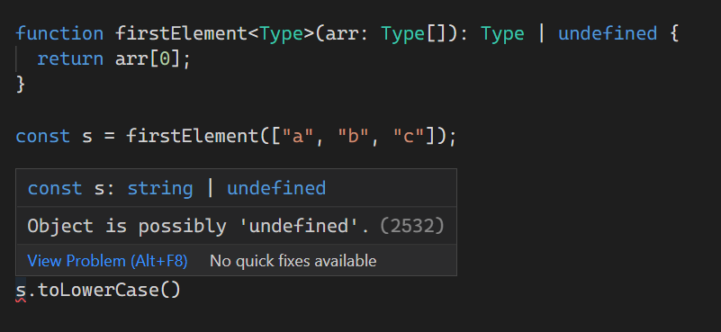
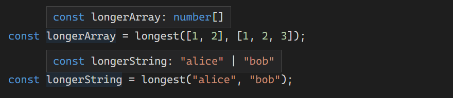

# 함수에 대해서

5주차는 Handbook의 More on Functions에 해당하는 내용을 학습했습니다. 타입스크립트에서 함수란 무엇인지 아주 자세하게 다룹니다.

<br>

## 함수 타입 표현식

함수를 타입으로 표현할 수 있다. 이를 함수 타입 표현식이라 부르며, 다음의 예시를 통해 알 수 있다.

```tsx
function greeter(fn: (a: string) => void) {
  fn("Hello, World");
}
 
function printToConsole(s: string) {
  console.log(s);
}
 
greeter(printToConsole);
```

`fn: (a: string) => void`

이 구문만 따로 놓고 보면, `fn` 이라는 변수가 있고, `a` 라는 매개변수에 문자열을 인수로 담아두고, 반환값이 딱히 없는 함수가 타입으로 정의된다는 것으로 보여진다.

함수를 변수로 지정하는 건 자바스크립트에서도 가능한 일이지만, 타입스크립트에서는 보다 명확하게 알 수 있다.

어쨌든 `fn` 은 함수를 타입으로 가진 변수가 되고, `fn`은 타입으로 정의된 함수만 받을 수 있게 된다.

그렇기 때문에 `printToConsole` 함수가 `fn` 에 인수로 담기고, `greeter` 함수 안에 `fn("Hello, World");` 을 처리할 수 있게 되는 거다.

함수를 타입으로 지정하는 예는 다음과 같은 구문도 있다.

```tsx
type GreetFunction = (a: string) => void;
function greeter(fn: GreetFunction) {
  fn("Hello, World");
}
```

<br>

## 호출 시그니처(Call Signatures)

자바스크립트에선 함수가 호출 구문 말고도 여러 속성을 가질 수 있다. 하지만 타입스크립트의 함수 타입 표현식만으로는 속성을 추가할 수가 없다. 이때 등장하는 게 호출 시그니처(Call Signatures)다.

```tsx
type DescribableFunction = {
  description: string;
  (someArg: number): boolean;
};

function doSometing(fn: DescribableFunction){
  console.log(fn.description + " returned " + fn(6));
}
```

객체가 가진 `(변수이름: 타입): 타입;`  형태의 속성을 호출 시그니처라고 부른다. 이런 속성을 가진 객체는 함수처럼 작동하며, 동시에 여러 속성을 가지게 되는 것이다.

예시에서 확인할 수 있듯이 `fn` 은 `description` 속성을 가지고도 함수처럼 작동하는 것을 볼 수 있다.

아래는 테스트용 전체 코드다.

```tsx
type DescribableFunction= {
  description: string;
  (someArg: number): boolean;
}

function doSometing(fn: DescribableFunction){
  console.log(fn.description + " returned " + fn(6));
}

const callTset: DescribableFunction = (someArg) => someArg < 5;
callTset.description = "Test";

doSometing(callTset)
```

어떤 객체는 자바스크립트의 `Date` 객체와 같이 `new` 연산을 통해 호출할 수도, 없이 호출할 수 있다.

```tsx
interface CallOrConstruct {
  new (s: string): Date;
  (n?: number): number;
}
```

<br>

## 제네릭 함수

타입스크립트에서 제네릭은 `<>` 안에 있는 타입을 매개변수의 타입으로 삼을 수 있음을 의미한다. 이를 타입 매개변수라고 부른다.

```tsx
function firstElement(arr: any[]) {
  return arr[0];
}
```

위의 예시처럼 `any` 타입의 배열로 해두면 반환값도 `any` 타입으로 정해지므로, 타입스크립트의 가이드가 하나도 작동하지 않게 된다.


이때 제네릭을 사용해보자.

```tsx
function firstElement<Type>(arr: Type[]): Type | undefined {
  return arr[0];
}
```

그러면 타입이 흐름에 맞게 부여되어 가이드가 다시 작동하게 된다.



### 추론

위에서 알 수 있듯이 제네릭을 사용하면 타입스크립트가 알아서 타입을 부여해준다. 이런 제네릭은 하나만 사용할 수 있을 뿐 아니라 여러 개로도 사용할 수도 있다.

제네릭 안에 담긴 타입들은 단지 이름일 뿐이라 원하는 대로 지정해도 된다.

```tsx
function map<Input, Output>(arr: Input[], func: (arg: Input) => Output): Output[] {
  return arr.map(func);
}

const parsed = map(["1", "2", "3"], (n) => parseInt(n));
```

### 제약

제네릭은 `any` 타입만 가능한 것이 아니다. 제약을 주면 해당 조건에 맞는 타입만 오도록 지정해줄 수 있다.

여기에 두 값 중 더 긴 값을 반환하는 함수가 있다. 긴 값을 판단하기 위해 `length` 속성이 필요하다. 제네릭에 `extends` 를 사용하면 인수로 올 수 있는 타입에 제약을 줄 수 있다.

```tsx
function longest<Type extends { length: number }>(a: Type, b: Type) {
  if (a.length >= b.length) {
    return a;
  } else {
    return b;
  }
}

const longerArray = longest([1, 2], [1, 2, 3]);
const longerString = longest("alice", "bob");
const notOK = longest(10, 100);
```

처음 두 호출은 문제가 없다. 각각 `number[]` 타입과 `"alice" | "bob"` 의 유니언 타입으로 정해져 있는 걸 알 수 있다.



하지만 세 번째 호출은 다르다. number 타입에는 `length` 속성이 없기 때문에 다음과 같은 오류가 발생한다.

``` text
Argument of type 'number' is not assignable to parameter of type '{ length: number; }'.
```

인수로 받은 값을 이용해 타입을 추론해냈고, `number` 에 `length` 속성이 없다는 것도 추론해냈다.

이것이 제네릭을 사용할 때의 장점이다.

### 제한된 값으로 작업

다음으로 제네릭 제약 조건을 사용해 작성한 코드가 있다.

```tsx
function minimumLength<Type extends { length: number }>(
  obj: Type,
  minimum: number
): Type {
  if (obj.length >= minimum) {
    return obj;
  } else {
    return { length: minimum };
Type '{ length: number; }' is not assignable to type 'Type'.
  '{ length: number; }' is assignable to the constraint of type 'Type', but 'Type' could be instantiated with a different subtype of constraint '{ length: number; }'.
  }
}
```

위 코드는 잘 작동할 것처럼 보이지만, `return { length: minimum };` 부분에서 오류를 보여줄 것이다. 함수가 반환하는 값은 `Type` 객체와 같아야 한다는 오류다. 반환되는 객체가 제약으로 지정되었다면, 해당 객체는 항상 같은 종류여야 한다.

만약 문제가 없었다면, 다음의 코드가 제대로 작동해야 한다.

```tsx
const arr = minimumLength([1, 2, 3], 6);

console.log(arr.slice(0));
```

하지만 실행해보면, `[**ERR**]: arr.slice is not a function` 라는 오류가 나타난다.

`arr` 가 반환은 되었지만, 기능이 없는 객체가 되고 만 것이다.

타입스크립트는 이런 일이 벌어질 걸 예상하고 알려준 거다.

### 타입 인수 지정

제네릭으로 지정해둔 타입은 일반적으로 호출 시에 유추하여 지정되지만, 그렇지 않은 경우도 종종 있다.

하나의 제네릭 타입으로 표현된 다음의 예시를 보자.

```tsx
function combine<Type>(arr1: Type[], arr2: Type[]): Type[] {
  return arr1.concat(arr2);
}
```

이 함수는 `any` 타입이 올 수 있지만, 숫자 배열과 문자열이 동시에 올 수도 있다. 이런 경우 아래와 같이 오류를 보여줄 것이다.

```tsx
const arr = combine([1, 2, 3], ["hello"]);
Type 'string' is not assignable to type 'number'.
```

이를 해결하기 위해선 제네릭의 타입을 수동으로 지정해줘야 한다. 사용법은 제네릭과 동일하다. 호출하는 부분에서 `<>` 안에 타입을 지정하면 된다.

```tsx
const arr = combine<string | number>([1, 2, 3], ["hello"]);
```

### 좋은 제네릭 함수 작성법

<br>

#### 1. 가능하면 타입 매개변수 자체를 제한하지 말 것

```tsx
function firstElement1<Type>(arr: Type[]) {
  return arr[0];
}
 
function firstElement2<Type extends any[]>(arr: Type) {
  return arr[0];
}
 
// a: number (good)
const a = firstElement1([1, 2, 3]);
// b: any (bad)
const b = firstElement2([1, 2, 3]);
```

두 함수를 비교했을 때, 첫 번째 방식이 더 좋은 함수다.

첫 번째 방식은 타입을 흐름대로 유추하여 `number` 타입으로 반환된다.

하지만 두 번째 방식은 `any` 타입으로 제한되어 있어서 반환도 `any` 타입으로 이루어졌다. 이는 타입스크립트가 해당 값을 반환하기 직전에 타입을 다시 유추하는 게 아니라 제한되어 있은 타입인 `any` 타입으로 반환해버리기 때문이다.

<br>

#### 2. 항상 가능한 적은 타입 매개변수를 사용할 것

```tsx
function filter1<Type>(arr: Type[], func: (arg: Type) => boolean): Type[] {
  return arr.filter(func);
}
 
function filter2<Type, Func extends (arg: Type) => boolean>(
  arr: Type[],
  func: Func
): Type[] {
  return arr.filter(func);
}
```

위의 예시에서 두 번째 함수는 `Func` 라는 타입을 `(arg: Type) => boolean` 라는 함수로 제한해뒀다. 그 때문에 타입 인수를 지정하려 할때 `Type` 와 `Func` , 두 인수를 모두 지정하지 않으면 오류가 발생한다. 또한 길게 작성된 제네릭의 타입으로 인해 가독성도 떨어졌다. 반면 첫 번째 함수는 단 하나의 인수만 지정해도 제약이 정상 작동하며, 가독성도 상당히 좋다.

```tsx
const a = filter1<number>(array, func)
const b = filter2<number, (arg: number) => boolean>(array, func)
```

많은 타입 매개변수가 오히려 독이 될 수 있는 것이다.

<br>

#### 3. 타입 매개변수가 한 번만 쓰이는 경우, 기존 타입 사용을 고려할 것

```tsx
function greet<Str extends string>(s: Str) {
  console.log("Hello, " + s);
}
```

제네릭에 `Str` 라는 타입을 만들어두었다. 문자열만 담기는 타입이다. 하지만 Str은 한 번만 사용되고 있다. 이런 경우를 아주 간단하게 표현하는 방법을 우리는 이미 알고 있다.

```tsx
function greet(s: string) {
  console.log("Hello, " + s);
}
```

제네릭은 여러 타입을 하나로 연결하기 위한 것이다. 단 한 번의 사용은 단순하게 타입을 사용하자.

<br>

## 선택적 매개변수

타입스크립트에서 `?` 를 매개변수 뒤에 붙이면, 해당 변수는 있어도, 없어도 된는 변수가 된다.

```tsx
function f(x?: number) {
  // ...
}
```

위 함수에서 `x` 의 뒤에  `?` 가 붙어있다. 이는 `number | undefined` 의 유니언 타입으로 정해진다. 값이 주어지면 `number` , 아무값도 주어지지 않으면 `undefined` 가 되는 식이다.

아무런 값이 정해지지 않은 경우, 그러니까 `undefined` 가 되는 상황일 때, `undefined` 대신 기본값을 제공할 수도 있다.

```tsx
function f(x = 10) {
  // ...
}
```

`x` 가 `number` 타입으로 정해지는 동시에 `undefined` 상황에선 기본으로 `10` 이란 값을 담게 된다. 아래 세 개의 호출문 모두 정상 작동하는 것이다.

```tsx
f();
f(10);
f(undefined);
```

### 콜백의 선택적 매개변수

다음의 예시를 보자.

`index` 가 있을 수도. 없을 수도 있기에 `?` 를 붙여 작성했다.

```tsx
function myForEach(arr: any[], callback: (arg: any, index?: number) => void) {
  for (let i = 0; i < arr.length; i++) {
    callback(arr[i], i);
  }
}
```

그래서 잘 작동할까?

아래의 두 호출은 잘 작동한다고 말할 수 있다.

```tsx
myForEach([1, 2, 3], (a) => console.log(a));
myForEach([1, 2, 3], (a, i) => console.log(a, i));
```

하지만 다음의 경우는 아니다.

```tsx
myForEach([1, 2, 3], (a, i) => {
  console.log(i.toFixed());
Object is possibly 'undefined'.
});
```

`index` 에 해당하는 `i` 가 `undefined` 일 수도 있다는 오류가 나타났다.

해결 방법은 간단하다. `?` 를 없애면 된다.

함수를 작성할 때 콜백 부분은 `?` 문이 없어도 오류라고 판단하지 않는다. 매개변수보다 인수가 많은 함수를 호출할 때, 자바스크립트와 타입스크립트는 추가로 주어진 인수를 무시한다.

```tsx
function myForEach(arr: any[], callback: (arg: any, index: number) => void) {
  for (let i = 0; i < arr.length; i++) {
    callback(arr[i], i);
  }
}
```

즉, `?` 없이 위의 예시처럼 작성하더라도 아래의 세 개의 호출문 모두가 정상 작동한다.

```tsx
myForEach([1, 2, 3], (a) => console.log(a));
myForEach([1, 2, 3], (a, i) => console.log(a, i));
myForEach([1, 2, 3], (a, i) => {
  console.log(i.toFixed());
});
```

<br>

## 함수 오버로드

자바스크립트의 어떤 함수들은 인수의 개수나 타입을 다양하게 하여 호출할 수 있다. 이를 가능하게 하는 것이 오버로드이며, 호출 시그니처처럼 오버로드 시그니처를 작성하는 것으로 사용할 수 있다.

오버로드 시그니처는 같은 함수를 아래의 예시처럼 필요한 인수와 타입을 나열하는 것으로 작성할 수 있다.

```tsx
function makeDate(timestamp: number): Date;
function makeDate(m: number, d: number, y: number): Date;
function makeDate(mOrTimestamp: number, d?: number, y?: number): Date {
  if (d !== undefined && y !== undefined) {
    return new Date(y, mOrTimestamp, d);
  } else {
    return new Date(mOrTimestamp);
  }
}
const d1 = makeDate(12345678);
const d2 = makeDate(5, 5, 5);
const d3 = makeDate(1, 3);
No overload expects 2 arguments, but overloads do exist that expect either 1 or 3 arguments.
```

인자의 개수가 다른 `d3` 의 경우 과부족에 대한 오류가 나타나는 것을 확인할 수 있다.

### 오버로드 시그니처와 구현 시그니처

모든 오버로드 시그니처는 구현된 함수의 시그니처와 호환이 되어야 한다. 숫자를 인수로 받아두면 문자열의 `toUpperCase()` 함수가 작동하지 않는 것처럼 모든 인수의 기본 처리가 같아야 한다.

```tsx
function fn(x: string): void;
function fn() {
  // ...
}
fn();
Expected 1 arguments, but got 0.
```

위의 예시처럼 `x` 를 받는 오버로드 시그니처가 이미 있는 상황에선 해당 시그니처를 우선하여 오류를 보여준다.

```tsx
function fn(x: boolean): void;
function fn(x: string): void;
This overload signature is not compatible with its implementation signature.
function fn(x: boolean) {}
```

매개변수 타입이 다르거나,

```tsx
function fn(x: string): string;
function fn(x: number): boolean;
This overload signature is not compatible with its implementation signature.
function fn(x: string | number) {
  return "oops";
}
```

반환 타입이 다른 경우 같이 호환되지 않는 경우, 타입스크립트는 위와 같은 오류를 보여줄 것이다.

### 좋은 오버로드 작성법

<br>

#### 항상 오버로드보다 유니언 타입을 먼저 고려할 것

다음과 같은 오버로드를 활용한 함수를 만들어 뒀다고 하자.

```tsx
function len(s: string): number;
function len(arr: any[]): number;
function len(x: any) {
  return x.length;
}
```

이 함수는 아래의 예시처럼 문자열이나 배열로 호출하는 데에 문제가 없다.

```tsx
len("");
len([0]);
```

하지만 문자열일 수도 있고, 배열일 수도 있는 다음과 같은 호출은 문제가 있다.

```tsx
len(Math.random() > 0.5 ? "hello" : [0]);
No overload matches this call.
  Overload 1 of 2, '(s: string): number', gave the following error.
    Argument of type 'number[] | "hello"' is not assignable to parameter of type 'string'.
      Type 'number[]' is not assignable to type 'string'.
  Overload 2 of 2, '(arr: any[]): number', gave the following error.
    Argument of type 'number[] | "hello"' is not assignable to parameter of type 'any[]'.
      Type 'string' is not assignable to type 'any[]'.
```

장황한 오류가 나타나 버리는 거다.

오류를 해결하기 위해선 오버로드가 아닌 유니언 타입을 사용하면 쉽게 해결된다.

```tsx
function len(x: any[] | string) {
  return x.length;
}
```

### 함수에서 `this` 선언하기

타입스크립트는 코드 흐름 분석을 통해 함수에서 `this` 가 무엇인지 추론할 수 있다.

다음의 예시를 보자.

```tsx
const user = {
  id: 123,

  admin: false,
  becomeAdmin: function () {
    this.admin = true;
  },
};
```

`user` 객체 안에 들어있는 `becomeAdmin` 함수는 `this` 가 외부 객체인 `user` 인 것을 알고 있다. 함수 내부에서 `this` 를 이용해 더 많은 제어가 필요한 경우가 있다. 자바스크립트에서는 `this` 라는 매개변수는 없지만, 타입스크립트에서는 `this` 라는 매개변수를 선언하여 사용할 수 있다.

```tsx
interface DB {
  filterUsers(filter: (this: User) => boolean): User[];
}

const db = getDB();
const admins = db.filterUsers(function (this: User) {
  return this.admin;
});
```

이런 패턴은 일반적으로 함수가 호출되었을 때 다른 객체가 제어하는 콜백 스타일의 API에서 흔하게 나타난다. 이런 동작을 원한다면 `⇒` 기능이 아니라 함수로 작성해 사용해야 한다.

```tsx
const admins = db.filterUsers(() => this.admin);
The containing arrow function captures the global value of 'this'.
Element implicitly has an 'any' type because type 'typeof globalThis' has no index signature.
```

<br>

## 알아야 할 다른 타입들

함수에서 타입을 사용할 때 자주 나타나는 몇 가지 타입을 살펴보자.

### `void`

값을 반환하지 않는 함수의 반환 타입이다. `return` 문이 없거나 `return` 문으로 특정 값을 반환하지 않았을 때 유추된다.

```tsx
function noop() {
  return;
}
```

자바스크립트는 어떤 값도 반환하지 않으면 `undefined` 가 되지만, 타입스크립트에선 `void`
 와 `undefined` 는 별개의 타입이다.

### `object`

원시 값(`string`, `number`, `bigint`, `boolean`, `symbol`, `null`, `undefined`)이 아닌 값은 `object` 타입에 속한다. `object` 타입은 빈 객체 타입 `{}` 과 전역 타입 `Object` 와 다르다. `Object` 타입은 사용하지 않을 수 있다. `Object` 와 `object` 항상 구분하자. 대부분 소문자인 `object` 를 사용한다.

자바스크립트에선 함수도 객체에 속한다. 속성을 가지고 있고, `Object.prototype` 이 프로토타입 체인에 있으며, `instanceof Object` 이고, `Object.keys`를 호출할 수 있는 등. 이런 여러 이유로 함수의 타입은 타입스크립트에서 `object`로 간주합니다.

### `unknown`

알 수 없는 모든 값을 나타낸다. 이 타입은 `any` 와 비슷하지만, `unknown` 타입을 이용하면 모든 작업을 할 수 없게 되어서 안전하다.

```tsx
function f1(a: any) {
  a.b(); // 문제없음
}
function f2(a: unknown) {
  a.b();
Object is of type 'unknown'.
}
```

함수 본문에서 `any` 타입 없이 어떤 값도 받아들여 함수의 타입을 설명할 수 있기 때문에 함수의 타입을 설명할 때 유용하다.

반대로, 알 수 없는 타입의 값을 반환하는 함수를 설명할 수 있다.

```tsx
function safeParse(s: string): unknown {
  return JSON.parse(s);
}

// Need to be careful with 'obj'!
const obj = safeParse(someRandomString);
```

### `never`

어떤 함수는 값을 절대 반환하지 않는다.

```tsx
function fail(msg: string): never {
  throw new Error(msg);
}
```

위의 예시에서처럼 값을 반환하지 않고 예외가 발생해 프로그램을 종료시키기 때문에 아무런 값도 반환되지 못한다. 이런 상황에서 `never` 타입이 사용된다.

유니언에서 남아있는 타입이 없다고 판단할 때도 타입이 `never` 타입으로 결정된다.


### `Function`

전역 타입 `Fucntion` 은 자바스크립트의 모든 함수 값에 속하는 `bind`, `call`, `apply`, 및 기타 속성을 설명한다. 또한 `Fucntion` 타입의 값을 항상 호출할 수 있는 특별한 속성을 가지고 있으며, 이런 호출은 `any` 타입을 반환한다.

```tsx
function doSomething(f: Function) {
  return f(1, 2, 3);
}
```

이것은 형식화되지 않은 호출이고, 안전하지 않은 `any` 타입을 반환하기 때문에 피하는 것이 좋다.

임의의 함수를 사용해야 하는 경우에는 `() => void` 형태의 타입을 사용하는 것이 더 안전하다.

<br>

## 나머지(Rest) 매개변수 및 인수

### 나머지 매개변수

고정 개수의 매개변수 말고 무한한 개수의 인수를 사용하는 나머지 매개변수를 정의할 수 있다.

나머지 매개변수는 `…` 구문을 추가하는 것으로 정의할 수 있다.

```tsx
function multiply(n: number, ...m: number[]) {
  return m.map((x) => n * x);
}
// 'a' gets value [10, 20, 30, 40]
const a = multiply(10, 1, 2, 3, 4);
```

인수가 지정한 매개변수 이상으로 주어져도 정상적으로 작동하는 것을 확인할 수 있다.

### 나머지 인수

반대로 배열에서 변수만큼의 인수를 차례로 제공할 수 있다. 예를 들어, `push` 함수를 사용해 배열에 추가하려 할 때 사용하면 하나의 인수를 순서대로 제공된다.

```tsx
const arr1 = [1, 2, 3];
const arr2 = [4, 5, 6];
arr1.push(...arr2);
```

일반적으로 타입스크립트는 배열이 변할 수도 있다고 가정한다. 하지만 `…` 구문을 사용하는 배열의 값은 절대 변하지 않아야 한다.

```tsx
const args = [8, 5];
const angle = Math.atan2(...args);
A spread argument must either have a tuple type or be passed to a rest parameter.
```

위의 예시처럼 `args` 는 배열이지만 나머지 인수를 사용할 수 없었다. 이런 상황에서 가장 좋은 해결법은 `as const` 를 붙이는 것이다.

```tsx
const args = [8, 5] as const;
const angle = Math.atan2(...args);
```

<br>

## 매개변수 분해

함수에 인수가 객체로 제공되었을 때 매개변수 분해를 사용하면 함수에서 사용할 수 있도록 로컬 변수로 꺼내진다.

자바스크립트에선 이렇다.

```tsx
function sum({ a, b, c }) {
  console.log(a + b + c);
}
sum({ a: 10, b: 3, c: 9 });
```

그리고 타입스크립트에서는 이렇게 작성된다.

```tsx
function sum({ a, b, c }: { a: number; b: number; c: number }) {
  console.log(a + b + c);
}
```

또한 객체 타입을 만들어 다음처럼 작성할 수도 있다.

```tsx
type ABC = { a: number; b: number; c: number };
function sum({ a, b, c }: ABC) {
  console.log(a + b + c);
}
```

<br>

## 함수의 할당 가능성

### `void` 타입 반환

타입스크립트에선 함수의 반환 타입이 `void` 타입으로 정해졌을 때 반환되는 값을 강제하지 않는다. 아래의 예시를 보면 `void` 타입이 반환 타입인데도 불구하고 코드가 정상적으로 작동한다.

```tsx
type voidFunc = () => void;
 
const f1: voidFunc = () => {
  return true;
};
 
const f2: voidFunc = () => true;
 
const f3: voidFunc = function () {
  return true;
};
```

그리고 해당 반환값은 모두 `void` 타입을 유지한다.


다음의 예시를 살펴보면, 배열의 `push` 함수로 인해 반환값이 `number` 타입이 되었지만 `forEach` 함수로 인해 함수의 반환은 `void` 타입의 값이 되고 만다. 하지만 정상적인 코드다.

```tsx
const src = [1, 2, 3];
const dst = [0];

src.forEach((el) => dst.push(el));
```

화살표 구문이 아닌 일반적인 함수를 정의할 때 반환 타입을 `void` 라고 정의해두면, 원칙적으로 아무것도 반환하지 않아야 한다는 것도 알아둬야 한다.

```tsx
function f2(): void {
  return true;
Type 'boolean' is not assignable to type 'void'.
}

const f3 = function (): void {
  return true;
Type 'boolean' is not assignable to type 'void'.
};
```
