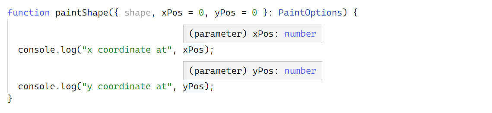

# 객체 타입

6주차는 Handbook의 Object Types에 해당하는 내용을 학습했습니다. 객체 타입의 특성과 여러 기능들을 다룹니다.

앞선 예시에서 객체 타입을 세 가지 방식을 표현했습니다.

익명 표현:

```tsx
function greet(person: { name: string; age: number }) {
  return "Hello " + person.name;
}
```

인터페이스 표현:

```tsx
interface Person {
  name: string;
  age: number;
}
 
function greet(person: Person) {
  return "Hello " + person.name;
}
```

타입 별칭 표현:

```tsx
type Person = {
  name: string;
  age: number;
};
 
function greet(person: Person) {
  return "Hello " + person.name;
}
```

이런 객체들을 어떻게 꾸며서 사용할 수 있는지를 한 번 알아봅시다.

<br>

## 타입 수식어

### 선택적 속성

객체의 속성이 선택 사항이라면, 속성 이름 뒤에 `?` 를 붙이는 것으로 선택적 속성으로 만들 수 있다.

```tsx
interface PaintOptions {
  shape: Shape;
  xPos?: number;
  yPos?: number;
}

function paintShape(opts: PaintOptions) {
  // ...
}

const shape = getShape();
paintShape({ shape });
paintShape({ shape, xPos: 100 });
paintShape({ shape, yPos: 100 });
paintShape({ shape, xPos: 100, yPos: 100 });
```

위 예시에서 `xPos` 와 `yPos` 는 선택 사항이 되어 값을 생략해도 된다. 만약 생략될 경우에는 `undefined` 타입이 부여된다. 그 때문에 선택적 속성은 기존 `number` 타입과 `undefined` 타입이 모두 올 수 있는 `number | undefined` 의 유니언 타입으로 추론된다.


자바스크립트에서는 값이 주어지지 않더라도 처리할 수가 있다. `undefined` 를 값으로 생각해서 처리하면 된다.


또한 선택적 속성에 기본값을 줘서 해당 속성이 생략되면 기본값을 사용해 처리할 수 있다.



여기서는 `paintShape` 함수의 매개변수에 구조 분해 패턴을 이용하고 `xPos` 와 `yPos` 에 기본값을 제공했다. 해당 속성에 값이 주어지지 않는다면 기본으로 `0`이 주어진다.

구조 분해 패턴을 사용한다면 `속성: 타입` 의 별칭을 지정할 수 없다. 자바스크립트에서는 다르게 해석하기 때문이다.

```tsx
function draw({ shape: Shape, xPos: number = 100 /*...*/ }) {
  render(shape);
Cannot find name 'shape'. Did you mean 'Shape'?
  render(xPos);
Cannot find name 'xPos'.
}
```

해당 구문을 `속성: 타입` 이 아니라 `속성: 로컬변수` 로 해석해서 함수 내부에서 사용할 새로운 로컬 변수로 다시 할당해버리는 것이다. `shape` 는 `Shape` 라는 로컬변수로, `xPos` 는 `number` 라는 로컬변수로 만들어져서 의도대로 작동하지 않게 된다.

<br>

### `readonly` 속성

타입스크립트에서 읽기 전용 속성, `readonly` 를 만들 수 있다. 타입 검사에 사용되며, 해당 속성을 수정하려할 때 오류를 보여준다.

```tsx
interface SomeType {
  readonly prop: string;
}
 
function doSomething(obj: SomeType) {
  // 속성을 읽을 수 있다.
  console.log(`prop has the value '${obj.prop}'.`);
 
  // 하지만 다시 할당하지는 못한다.
  obj.prop = "hello";
Cannot assign to 'prop' because it is a read-only property.
}
```

속성에 `readonly` 수식어를 사용한다고 해서 값이 절대 바뀌지 않는 게 아니다. 단지 속성 자체를 다시 할당할 수 없다는 걸 의미한다.

```tsx
interface Home {
  readonly resident: { name: string; age: number };
}
 
function visitForBirthday(home: Home) {
  // 'home.resident'의 속성들을 읽고 수정할 수 있다.
  console.log(`Happy birthday ${home.resident.name}!`);
  home.resident.age++;
}
 
function evict(home: Home) {
  // 하지만 'Home'의 속성인 'resident' 자체를 할당할 수가 없다.
  home.resident = {
Cannot assign to 'resident' because it is a read-only property.
    name: "Victor the Evictor",
    age: 42,
  };
}
```

타입스크립트는 두 객체가 서로 호환되는지 확인할 때 해당 속성이 `readonly` 속성인지는 고려하지 않는다.

```tsx
interface Person {
  name: string;
  age: number;
}
 
interface ReadonlyPerson {
  readonly name: string;
  readonly age: number;
}
 
let writablePerson: Person = {
  name: "Person McPersonface",
  age: 42,
};
 
let readonlyPerson: ReadonlyPerson = writablePerson;
 
console.log(readonlyPerson.age); // '42' 출력
writablePerson.age++;
console.log(readonlyPerson.age); // '43' 출력
```

`writablePerson` 객체가 `ReadonlyPerson` 객체 타입을 별칭으로 `readonlyPerson` 객체에 할당되었다. `writablePerson` 은 읽기와 수정이 모두 가능하지만, `readonlyPerson` 은 읽기만 가능하게 된다. 또한 `writablePerson` 의 값이 바뀌면 `readonlyPerson` 에서도 값이 바뀌는 걸 확인할 수 있다.

`readonly` 속성을 적절하게 사용한다면, 서로의 역할을 명확하게 나눌 수 있는 것이다.

### 인덱스 시그니처

다음은 인덱스 시그니처를 이용해 객체가 `string`을 담는 배열처럼 작동하는 예시다.

```tsx
interface StringArray {
  [index: number]: string;
}

const myArray: StringArray = getStringArray();
const secondItem = myArray[1];
```

`StringArray` 인터페이스는 `number` 타입으로 인덱싱될 때 해당 문자열을 반환해준다. 이때 인덱스 시그니처의 속성 타입은 `string` 이나 `number` 타입이어야 한다.

인덱스 시그니처는 두 가지 타입의 인덱서를 모두 지원할 수 있지만, 숫자 인덱서가 반환하는 타입이 문자열 인덱서와 같은 타입이거나 하위 타입이어야 한다.

아래의 예시처럼 `extends` 문을 사용한 객체라면, 숫자 인덱서는 상위 객체를 반환할 수 없다.

```tsx
interface Animal {
  name: string;
}
 
interface Dog extends Animal {
  breed: string;
}

interface Okay {
  [x: number]: Dog;
  [x: string]: Animal;
}

interface NotOkay {
  [x: number]: Animal;
'number' index type 'Animal' is not assignable to 'string' index type 'Dog'.
  [x: string]: Dog;
}
```

인텍스가 `string` 타입일 경우에는 해당 인덱스는 마치 그 객체의 속성인 것처럼 접근할 수 있게 된다. 이때 다른 속성의 타입은 인덱스의 반환 타입과 같아야 한다. 타입이 서로 다르다면 오류가 발생한다.

```tsx
interface NumberDictionary {
  [index: string]: number;

  length: number;
  name: string;
Property 'name' of type 'string' is not assignable to 'string' index type 'number'.
}
```

인덱스의 반환 타입이 유니언 타입이라면 다른 속성의 타입으로 지정할 수 있다.

```tsx
interface NumberOrStringDictionary {
  [index: string]: number | string;

  length: number;
  name: string;
}
```

인덱스 시그니처에도 다시 할당하는 것을 막는 `readonly` 수식어를 붙일 수 있다.

```tsx
interface ReadonlyStringArray {
  readonly [index: number]: string;
}
 
let myArray: ReadonlyStringArray = getReadOnlyStringArray();
myArray[2] = "Mallory";
Index signature in type 'ReadonlyStringArray' only permits reading.
```

<br>

## 확장 타입

기존에 만들어둔 객체를 좀 더 자세하게 만들어야 하는 일이 자주 생긴다.

다음의 예시를 보자.

```tsx
interface BasicAddress {
  name?: string;
  street: string;
  city: string;
  country: string;
  postalCode: string;
}
```

경우에 따라서는 기본 주소로도 충분하다. 하지만 아파트 같은 건물은 동과 호수가 많다. 이런 경우 해당 정보를 작성할 수 있도록 추가해야 할 것이다. `unit` 을 추가해보자.

```tsx
interface AddressWithUnit {
  name?: string;
  unit: string;
  street: string;
  city: string;
  country: string;
  postalCode: string;
}
```

하지만 `BasicAddress` 와 `AddressWithUnit` 의 차이점은 고작 `unit` 속성 하나뿐이다. 이럴 경우 코드는 쓸데없이 길어지고 비효율적이다. 이를 해결하는 방법이 `extends` , 확장이다.

```tsx
interface BasicAddress {
  name?: string;
  street: string;
  city: string;
  country: string;
  postalCode: string;
}
 
interface AddressWithUnit extends BasicAddress {
  unit: string;
}
```

코드는 간결해졌고, 새로운 속성도 쉽게 추가할 수 있게 되었다.

이런 확장은 다음처럼 여러 타입에서도 확장할 수 있다.

```tsx
interface Colorful {
  color: string;
}
 
interface Circle {
  radius: number;
}
 
interface ColorfulCircle extends Colorful, Circle {}
 
const cc: ColorfulCircle = {
  color: "red",
  radius: 42,
};
```

<br>

## 교차 타입

타입스크립트는 기존 객체 타입을 결합해주는 교차 타입을 제공한다.

```tsx
interface Colorful {
  color: string;
}
interface Circle {
  radius: number;
}
 
type ColorfulCircle = Colorful & Circle;
```

위의 예시처럼 교차 타입은 `&` 연산자를 사용하여 정의할 수 있다.

## 인터페이스 vs 교차 타입

<table>

<tr align="center">
<td>

**인터페이스**

</td>
<td>

**교차 타입**

</td>
</tr>

<tr>
<td>인터페이스 확장 사용</td>
<td>교차 타입 사용</td>
</tr>

<tr>
<td>

```tsx
interface Colorful {
  color: string;
}
interface Circle {
  radius: number;
}

interface ColorfulCircle extends Colorful, Circle {}

```

</td>
<td>

```tsx
interface Colorful {
  color: string;
}
interface Circle {
  radius: number;
}

type ColorfulCircle = Colorful & Circle;

```

</td>
</tr>

<tr>
<td>충돌이 있을 때 인터페이스 확장 부분에서 오류가 발생한다</td>
<td>충돌이 있을 때 해당 속성을 `never` 타입으로 추론한다</td>
</tr>

<tr>
<td>

```tsx
interface Colorful {
  test: string;
  color: string;
}
interface Circle {
  test: number;
  radius: number;
}

interface ColorfulCircle extends Colorful, Circle {}
Interface 'ColorfulCircle' cannot simultaneously extend types 'Colorful' and 'Circle'.
  Named property 'test' of types 'Colorful' and 'Circle' are not identical.

const cc: ColorfulCircle = {
  test: "a",
  color: "red",
  radius: 42,
};

```

</td>
<td>

```tsx
interface Colorful {
  test: string;
  color: string;
}
interface Circle {
  test: number;
  radius: number;
}

type ColorfulCircle = Colorful & Circle;

const cc: ColorfulCircle = {
  test: "a",
Type 'string' is not assignable to type 'never'.                                     

  color: "red",
  radius: 42,
};

```

</td>
</tr>
</tbody>

</table>

<br>

## 제네릭 객체 타입

여러 타입을 받아야 하는 속성이 필요할 때가 있다. 그때 `any` 타입을 사용했다고 하자.

```tsx
interface Box<Type> {
  contents: Type;
}
```

`Box` 안의 `contents` 속성은 이제 어떤 값이든 받을 수 있다. 하지만 타입스크립트의 가이드는 받을 수 없게 되어 예상치 못한 오류가 발생할 수 있다.

대신해서 `unknown` 타입을 사용할 수 있지만, 사용하기 전에 타입을 좁히는 과정이 필요하다.

```tsx
interface Box {
  contents: unknown;
}
 
let x: Box = {
  contents: "hello world",
};
 
// we could check 'x.contents'
if (typeof x.contents === "string") {
  console.log(x.contents.toLowerCase());
}

// or we could use a type assertion
console.log((x.contents as string).toLowerCase());
```

또 다른 방법으로 각 타입을 다른 객체로 만들 수도 있다.

```tsx
interface NumberBox {
  contents: number;
}
 
interface StringBox {
  contents: string;
}
 
interface BooleanBox {
  contents: boolean;
}
```

하지만 이 방법은 새로운 타입이 필요할 때마다 매번 객체를 생성해야 하고, 오버로드의 경우 불필요하게 길어진다.

```tsx
function setContents(box: StringBox, newContents: string): void;
function setContents(box: NumberBox, newContents: number): void;
function setContents(box: BooleanBox, newContents: boolean): void;
function setContents(box: { contents: any }, newContents: any) {
  box.contents = newContents;
}
```

이때 필요한 것이 제네릭이다. 객체 타입도 함수의 제네릭과 같이 어떤 타입이라도 받을 수 있도록 정의할 수 있다.

```tsx
interface Box<Type> {
  contents: Type;
}
```

`Box` 는 이제 모든 타입을 처리할 수 있는 객체가 되었다. 사용하기 전에 미리 타입을 지정해주기만 하면 된다.

```tsx
let box: Box<string>;
```

위의 `Box<string>` 처럼 제네릭 객체로 만들게 되면, `contents: string` 과 동일하게 작동하는 걸 확인할 수 있다.


이때 `Type` 은 모든 타입을 담을 수 있어서 객체 타입도 받을 수 있다.

```tsx
interface Box<Type> {
  contents: Type;
}
 
interface Apple {
  // ....
}
 
type AppleBox = Box<Apple>;
```

함수를 만들 때도 앞선 예시처럼 복잡한 오버로드는 필요 없어진다.

```tsx
function setContents<Type>(box: Box<Type>, newContents: Type) {
  box.contents = newContents;
}
```

타입 별칭으로도 제네릭 객체를 정의할 수 있다.

<table>

<tr align="center">
<td>

**인터페이스**

</td>
<td>

**타입 별칭**

</td>
</tr>

<tr>
<td>

```tsx
interface Box<Type> {
  contents: Type;
}
```

</td>
<td>

```tsx
type Box<Type> = {
  contents: Type;
};
```

</td>
</tr>

</table>

타입 별칭은 인터페이스와 달리 단순한 객체 타입보다 더 자세하게 설명할 수 있어서 다른 종류의 제네릭 도우미 타입으로 사용하기도 한다.


### `Array` 타입

제네릭 객체 타입 중에 `Array` 타입이 있다. 이 타입은 이미 여러 번 써왔다. `number[]` , 숫자 배열은 사실 `Array<number>` 를 줄여서 쓴 것이다.

```tsx
function doSomething(value: Array<string>) {
  // ...
}
 
let myArray: string[] = ["hello", "world"];
 
// 둘 다 동작한다.
doSomething(myArray);
doSomething(new Array("hello", "world"));
```

위에서 만들었던 `Box` 객체와 마찬가지로 `Array` 자체는 제네릭 객체 타입이다.

```tsx
interface Array<Type> {
  /**
   * Gets or sets the length of the array.
   */
  length: number;
 
  /**
   * Removes the last element from an array and returns it.
   */
  pop(): Type | undefined;
 
  /**
   * Appends new elements to an array, and returns the new length of the array.
   */
  push(...items: Type[]): number;
 
  // ...
}
```

최신 자바스크립트는 `Map<K, V>` , `Set<T>` , `Promise<T>` 과 같은 제네릭인 데이터 구조를 제공한다. 이는 `Map` , `Set` , `Promise` 모두 객체 타입처럼 작동한다는 의미다.

### `ReadonlyArray` 타입

배열도 `ReadonlyArray` 를 이용해 변경할 수 없도록 만들 수 있다.

```tsx
function doStuff(values: ReadonlyArray<string>) {
  // 'values'의 값을 읽을 수 있다.
  const copy = values.slice();
  console.log(`The first value is ${values[0]}`);
 
  // 하지만 'values'를 바꿀 수는 없다.
  values.push("hello!");
Property 'push' does not exist on type 'readonly string[]'.
}
```

속성의 값을 바꿀 수 없도록 하는 `readonly` 와 같다. 변경되면 안 되는 배열이 예기치 않게 수정되는 것을 방지할 수 있게 된다.

`ReadonlyArray` 는 `Array` 와 다르게 생성자가 따로 없다.

```tsx
new ReadonlyArray("red", "green", "blue");
'ReadonlyArray' only refers to a type, but is being used as a value here.
```

대신 일반 `Array` 를 `ReadonlyArray` 에 할당할 수 있다.

```tsx
const roArray: ReadonlyArray<string> = ["red", "green", "blue"];
```

타입스크립트가 `Array<Type>` 을 `Type[]` 으로 줄여준 것처럼 `ReadonlyArray<Type>` 을 `readonly Type[]` 으로 줄여서 쓸 수 있다.

```tsx
function doStuff(values: readonly string[]) {
  // We can read from 'values'...
  const copy = values.slice();
  console.log(`The first value is ${values[0]}`);
 
  // ...but we can't mutate 'values'.
  values.push("hello!");
Property 'push' does not exist on type 'readonly string[]'.
}
```

주의할 점이 있는데, `readonly` 수식어로 `ReadonlyArray` 를 만들게 되면, 일반 `Array` 에 할당할 수 없다.

```tsx
let x: readonly string[] = [];
let y: string[] = [];
 
x = y;
y = x;
The type 'readonly string[]' is 'readonly' and cannot be assigned to the mutable type 'string[]'.
```

### 튜플 타입

무한한 요소를 가진 배열 타입과 달리 튜플 타입은 요소의 개수와 타입을 제한할 수 있다.

```tsx
type StringNumberPair = [string, number];
```

위의 예시에서 `StringNumberPair` 는 두 개의 속성을 가질 수 있고, 각각 `string` 타입과 `number`  타입이다. 이 표현은 타입스크립트만의 표현으로 런타임에는 의미가 없다. 하지만 타입 시스템에서 `StringNumberPair` 의 인덱스 `0` 번이 문자열, `1` 번이 숫자라는 걸 설명해준다.


인덱스가 요소의 개수를 초과하면 오류가 발생한다.

```tsx
function doSomething(pair: [string, number]) {
  // ...
 
  const c = pair[2];
Tuple type '[string, number]' of length '2' has no element at index '2'.
}
```

또한 자바스크립트의 배열 구조 분해를 통해 구조 분해 튜플을 사용할 수 있다.


튜플 타입은 각 요소의 의미가 명확한 API에서 유용하다. 위의 예시처럼 구조 분해를 이용하면 변수 이름을 지정할 수 있는 유연성을 가지고 있다.

다음의 예시처럼 단순한 튜플 타입은 특정 인덱스를 속성으로 가지는 배열과 같다.

```tsx
interface StringNumberPair {
  // specialized properties
  length: 2;
  0: string;
  1: number;
 
  // Other 'Array<string | number>' members...
  slice(start?: number, end?: number): Array<string | number>;
}
```

튜플은 `?` 를 사용해 선택적 속성을 가질 수도 있다. 튜플의 마지막 요소에만 사용할 수 있다.


나머지 요소도 표현할 수 있다.

```tsx
type StringNumberBooleans = [string, number, ...boolean[]];
type StringBooleansNumber = [string, ...boolean[], number];
type BooleansStringNumber = [...boolean[], string, number];
```

하나의 튜플에서 나머지 요소는 단 한 번 사용할 수 있다. 위의 예시처럼 나머지 요소의 위치에 따라 각 요소의 타입이 정해진다.

나머지 요소를 사용한 튜플은 `length` 속성이 제거된다.

```tsx
const a: StringNumberBooleans = ["hello", 1];
const b: StringNumberBooleans = ["beautiful", 2, true];
const c: StringNumberBooleans = ["world", 3, true, false, true, false, true];
```

타입스크립트가 함수의 매개 변수의 목록과 튜플을 대응시킬 수 있다. 튜플 타입은 나머지 매개 변수와 인수를 사용할 수 있으므로 다음처럼 사용할 수 있다.

```tsx
function readButtonInput(...args: [string, number, ...boolean[]]) {
  const [name, version, ...input] = args;
  // ...
}
```

위의 예시는 기본적으로 다음과 같다

```tsx
function readButtonInput(name: string, version: number, ...input: boolean[]) {
  // ...
}
```

이 기능은 나머지 매개 변수를 사용해서 가변 개수의 인자를 적용해야 할 때, 적은 개수의 요소가 필요하지만, 중간 변수를 도입하고 싶지 않을 때 유용하다.

### `readonly` 튜플 타입

튜플 타입도 앞서 살펴봤던 `readonly` 수식어를 붙여 읽기 전용을 지정할 수 있다.

```tsx
function doSomething(pair: readonly [string, number]) {
  // ...
}
```

예상하는 것처럼 타입스크립트에서는 `readonly` 튜플 타입은 다시 할당할 수 없다.

```tsx
function doSomething(pair: readonly [string, number]) {
  pair[0] = "hello!";
Cannot assign to '0' because it is a read-only property.
}
```

튜플은 한 번 생성하면 더는 수정하지 않는 경우가 대부분이므로, 가능한 `readonly` 를 수식해주는 것이 좋다. 이는 `const` 에서 `readonly` 튜플 타입으로 추론되는 점에서도 중요하다.

```tsx
let point = [3, 4] as const;
 
function distanceFromOrigin([x, y]: [number, number]) {
  return Math.sqrt(x ** 2 + y ** 2);
}
 
distanceFromOrigin(point);
Argument of type 'readonly [3, 4]' is not assignable to parameter of type '[number, number]'.
  The type 'readonly [3, 4]' is 'readonly' and cannot be assigned to the mutable type '[number, number]'.
```
