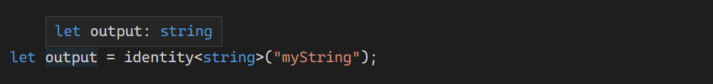
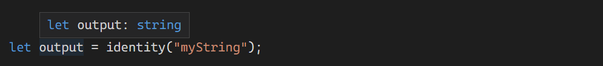

# 제네릭

8주차에는 The Handbook에서 제네릭에 대해 자세히 알아봅니다. 이전에 잠깐 나온 제네릭을 자세히 파헤칩니다.

## 기본

여러가지 타입을 담을 수 있는 제네릭의 기본은 이미 알듯이 `<Type>` 이다.

```tsx
function identity(arg: any): any {
  return arg;
}
```

위과 같이 모든 타입을 담고 싶을 때 제네릭을 사용할 수 있다.

```tsx
function identity<Type>(arg: Type): Type {
  return arg;
}
```

이렇게 되면 함수에 넘긴 인수의 타입을 `Type` 이란 타입 변수의 타입으로 삼아 나중에 사용할 수 있도록 한다. 위의 예시에선 반환 타입으로 다시 사용된다.

제네릭의 호출 방법은 두 가지 방법이 있다.

먼저, 타입 변수의 타입을 지정해주는 방법이 있고,



전달한 인수의 타입으로 알아서 유추되는 방법이 있다.



기본적으로 `<>` 안에 타입을 명시할 필요는 없지만, 복잡한 코드에서 컴파일러가 타입을 유추할 수 없는 경우에는 명시해둬야 하는 경우가 있다.

<br>

## 제네릭 타입 변수로 작업하는 법

제네릭을 사용하면 코드를 작성할 때 유추된 타입으로만 작성하도록 강요한다. 다음의 예시를 보자.

```tsx
function loggingIdentity<Type>(arg: Type): Type {
  console.log(arg.length);
Property 'length' does not exist on type 'Type'.
  return arg;
}
```

`Type` 에 `.length` 속성의 유무를 확인할 수 없어서 오류가 발생한다.

하지만 이 속성을 항상 가지고 있는 배열로 작성하면 오류는 없다.

```tsx
function loggingIdentity<Type>(arg: Type[]): Type[] {
  console.log(arg.length);
  return arg;
}
```

숫자 배열을 이 함수에 넘긴다면 `Type` 는 `number` 타입으로 유추되고, `arg` 는 숫자 배열이 담길 것이다. 반환 타입 역시 숫자 배열이 된다.

이런 방식으로 제네릭을 사용하는데, 제네릭은 함수 말고도, 인터페이스나 클래스에도 제네릭을 사용할 수 있다.

<br>

## 제네릭 타입

제네릭 함수의 타입은 타입 매개변수가 먼저 나열되는 일반적인 함수를 선언하는 것과 유사하게 작성된다.

```tsx
function identity<Type>(arg: Type): Type {
  return arg;
}
 
let myIdentity: <Type>(arg: Type) => Type = identity;
```

제네릭 타입 매개변수의 이름을 다른 이름으로 지정할 수도 있다.

```tsx
function identity<Type>(arg: Type): Type {
  return arg;
}
 
let myIdentity: <Input>(arg: Input) => Input = identity;
```

객체 리터럴 타입의 함수 호출 시그니처로 작성할 수도 있다:

```tsx
function identity<Type>(arg: Type): Type {
  return arg;
}
 
let myIdentity: { <Type>(arg: Type): Type } = identity;
```

위의 예시를 이용해 제네릭 인터페이스를 작성해볼 수 있다. 객체 리터럴를 인터페이스의 속성으로 가져온다.

```tsx
interface GenericIdentityFn {
  <Type>(arg: Type): Type;
}
 
function identity<Type>(arg: Type): Type {
  return arg;
}
 
let myIdentity: GenericIdentityFn = identity;
```

제네릭 매개변수를 인터페이스 전체에서 사용하고 싶을 때에는 다음과 같이 작성하면 된다.

```tsx
interface GenericIdentityFn<Type> {
  (arg: Type): Type;
}
 
function identity<Type>(arg: Type): Type {
  return arg;
}
 
let myIdentity: GenericIdentityFn<number> = identity;
```

## **제네릭 클래스**

제네릭 인터페이스와 제네릭 클래스는 형태가 비슷하다. 클래스 이름 뒤에 `<>` 안쪽에 제네릭 타입 매개변수 목록을 넣기만 하면된다.

```tsx
class GenericNumber<NumType> {
  zeroValue: NumType;
  add: (x: NumType, y: NumType) => NumType;
}
 
let myGenericNumber = new GenericNumber<number>();
myGenericNumber.zeroValue = 0;
myGenericNumber.add = function (x, y) {
  return x + y;
};
```

제네릭 타입 `NumType` 은 이름일 뿐이라서 `number` 타입을 강제하지는 않는다. `number` 대신 `string` 을 집어넣어도 정상 작동한다.

```tsx
let stringNumeric = new GenericNumber<string>();
stringNumeric.zeroValue = "";
stringNumeric.add = function (x, y) {
  return x + y;
};

console.log(stringNumeric.add(stringNumeric.zeroValue, "test"));
```

<br>

## **제네릭 제약조건**

앞선 예제에서 `.length` 를 속성처럼 특정 속성을 가지는 제네릭 타입을 원한다면, 이를 위해 제약조건이 있는 제네릭 타입을 만들 수 있다.

다음의 예시를 보자. 제약조건을 가지는 인터페이스를 만들어서 제네릭 타입에 `extends` 로 제약조건을 명시했다.

```tsx
interface Lengthwise {
  length: number;
}
 
function loggingIdentity<Type extends Lengthwise>(arg: Type): Type {
  console.log(arg.length); // Now we know it has a .length property, so no more error
  return arg;
}
```

제네릭 함수는 이제 제한적으로 동작한다.

아래와 같이 조건을 만족하지 못하면 오류가 발생한다,

```tsx
loggingIdentity(3);
Argument of type 'number' is not assignable to parameter of type 'Lengthwise'.
```

제네릭 타입에 필요한 조건을 모두 만족해야 함수가 동작한다.

```tsx
loggingIdentity({ length: 10, value: 3 });
```

<br>

## **제네릭 제약조건에서 타입** **매개변수 사용**

다른 제네릭 매개변수로 제한된 제네릭 매개변수를 선언할 수 있다. 객체에서 속성값을 가져오고 싶은 경우를 예로 들면, `obj` 에 존재하지 않는 속성값을 가져오는 실수를 하지 않기 위해서 다음과 같은 제약 조건을 만들었다.

```tsx
function getProperty<Type, Key extends keyof Type>(obj: Type, key: Key) {
  return obj[key];
}

let x = { a: 1, b: 2, c: 3, d: 4 };

getProperty(x, "a");
```

이 함수는 위의 상황에서는 정상적으로 작동할 것이다. 하지만 `x` 없는 속성값을 입력하면 다음과 같은 오류가 발생한다.

```tsx
getProperty(x, "m");
Argument of type '"m"' is not assignable to parameter of type '"a" | "b" | "c" | "d"'.
```

<br>

## **제네릭에서 클래스 타입 사용**

팩토리를 생성할 때 생성자 함수로 클래스 타입을 참조해야 한다.

```tsx
function create<Type>(c: { new (): Type }): Type {
  return new c();
}
```

다음의 고급 예제를 살펴보면, 클래스 타입의 인스턴스 사이의 관계를 유추하고 제한하는 걸 확인할 수 있다.

```tsx
// @strict: false
class BeeKeeper {
  hasMask: boolean;
}

class ZooKeeper {
  nametag: string;
}

class Animal {
  numLegs: number;
}

class Bee extends Animal {
  keeper: BeeKeeper;
}

class Lion extends Animal {
  keeper: ZooKeeper;
}

function createInstance<A extends Animal>(c: new () => A): A {
  return new c();
}

createInstance(Lion).keeper.nametag; // 타입검사!
createInstance(Bee).keeper.hasMask;  // 타입검사!
```

이 패턴은 [mixins](https://www.typescriptlang.org/docs/handbook/mixins.html) 디자인 패턴을 만드는데 사용된다고 한다.
