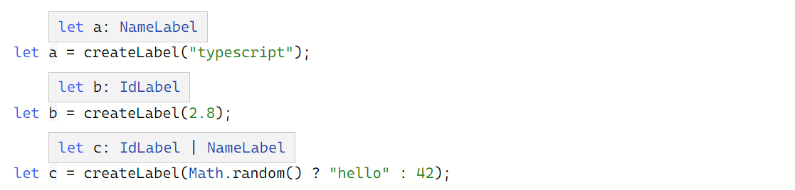
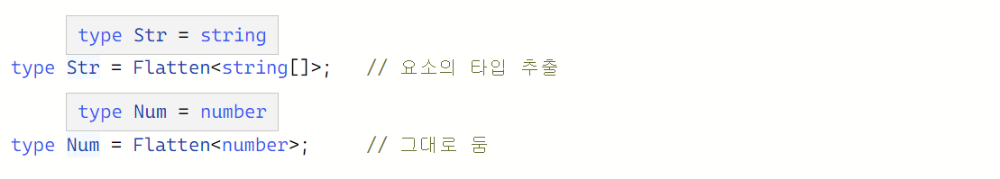

# 타입 조작

9주차에는 Handbook의 이전 주차에 다룬 제네릭을 제외한 Creating Types from Types 내용을 모두 학습했습니다.

<br>

## `Keyof` 타입 연산자

`keyof` 연산자는 객체 형식을 띠며, 키의 문자열 또는 숫자 리터럴 유니언을 만든다. 다음 예시에서 `P` 는 `“x” | “y”` 유니언 타입과 같다.

```tsx
type Point = { x: number; y: number };
type P = keyof Point;
```

타입에 `string` 또는 `number` 의 인덱스 시그니처를 가지고 있으면, `keyof` 는 다음과 같이 반환한다.

```tsx
type Arrayish = { [n: number]: unknown };
type A = keyof Arrayish;
     
type Mapish = { [k: string]: boolean };
type M = keyof Mapish;
```


위 예시에서 `M` 타입의 반환이 `string | number` 인 이유는 자바스크립트의 `obj[0]` 처럼 숫자 형태의 인덱스도 `obj["0"]` 와 같이 문자열 인덱스와 동일하게 작동하기 때문이다.

<br>

## `Typeof` 타입 연산자

`typeof` 연산자는 자바스크립트에 이미 존재한다.

```tsx
// "string"이 출력됨
console.log(typeof "Hello world");
```

타입스크립트에선 타입에서도 `typeof` 연산자를 사용할 수 있도록 해준다.

```tsx
let s = "hello";
let n: typeof s;
```


이는 다른 타입 연산자와 함께 사용하면 더 많은 패턴을 편리하게 표현할 수 있다.

예를 들어, 다음과 같은 예시를 보자. `ReturnType<>` 함수로 인해 `K` 는 `boolean` 타입이 된다.

```tsx
type Predicate = (x: unknown) => boolean;
type K = ReturnType<Predicate>;
```


하지만 함수의 이름으로 `ReturnType<>` 을 호출하면 다음과 같은 오류를 보여줄 것이다. `f` 함수가 타입이 아닌 값을 의미하기 때문이다.

```tsx
function f() {
  return { x: 10, y: 3 };
}
type P = ReturnType<f>;
'f' refers to a value, but is being used as a type here. Did you mean 'typeof f'?
```

이때 `typeof` 연산자를 이용해보자. 타입스크립트는 `f` 의 타입을 가져올 것이다.


`typeof` 는 제한사항이 있다. 변수 이름과 같은 식별자나 해당 속성에만 사용할 수 있다. 실행 중인 것으로 판단되는 코드는 `typeof` 를 사용할 수 없다.

```tsx
// Meant to use = ReturnType<typeof msgbox>
let shouldContinue: typeof msgbox("Are you sure you want to continue?");
',' expected.
```

<br>

## 인덱싱된 접근 타입

인덱싱된 접근 타입을 사용하여 다른 타입의 특정 속성을 검색할 수 있다.

```tsx
type Person = { age: number; name: string; alive: boolean };
type Age = Person["age"];
```


인덱싱 타입은 그 자체가 타입이기 때문에 유니언, `keyof` 같은 다른 타입을 사용할 수 있다.

```tsx
type I1 = Person["age" | "name"];

type I2 = Person[keyof Person];

type AliveOrName = "alive" | "name";
type I3 = Person[AliveOrName];
```


존재하지 않는 속성을 인덱싱하려고 하면 오류가 나타난다.

```tsx
type I1 = Person["alve"];
Property 'alve' does not exist on type 'Person'.
```

`number`를 사용하여 인덱싱할 수 있다. 이를 `typeof` 와 결합하여 배열 리터럴의 요소 유형을 편리하게 가져올 수도 있다.

```tsx
const MyArray = [
  { name: "Alice", age: 15 },
  { name: "Bob", age: 23 },
  { name: "Eve", age: 38 },
];

type Person = typeof MyArray[number];
type Age = typeof MyArray[number]["age"];
type Age2 = Person["age"];
```


인덱싱은 타입만 가능하다. 변수를 참조하기 위해서 상수를 이용할 수 없다.

```tsx
const key = "age";
type Age = Person[key];
Type 'key' cannot be used as an index type.
'key' refers to a value, but is being used as a type here. Did you mean 'typeof key'?
```

하지만 타입으로 바꾼다면 가능하다.

```tsx
type key = "age";
type Age = Person[key];
```

<br>

## 조건부 타입

조건부 타입은 입력 타입이 무언인지에 따라 출력 타입을 결정한다. 아래의 예시를 보자.

`Example1` 에서 `Dog extends Animal` 는 가능한 타입이라서 `number` 타입으로 결정되지만, `Example2` 의 `RegExp` 는 `Animal` 과 아무런 연관이 없기 때문에 `string` 타입으로 결정된다.

```tsx
interface Animal {
  live(): void;
}
interface Dog extends Animal {
  woof(): void;
}

type Example1 = Dog extends Animal ? number : string;
type Example2 = RegExp extends Animal ? number : string;
```

조건부 타입은 자바스크립티의 조건식( `조건 ? 참일때 : 거짓일때` )과 비슷한 형태로 다음과 같이 사용할 수 있다.

```tsx
어떤타입 extends 다른타입 ? 참일때타입 : 거짓일때타입;
```

`extends` 를 기준으로 왼쪽의 타입을 오른쪽 타입에 할당할 수 있다면 첫 번째 분기 타입으로, 아니라면 두 번째 분기 타입으로 결정된다.

이런 조건식 타입은 제네릭과 함께 사용할 때 효과적이다. 다음의 예시를 보자.

```tsx
interface IdLabel {
  id: number;
}
interface NameLabel {
  name: string;
}

function createLabel(id: number): IdLabel;
function createLabel(name: string): NameLabel;
function createLabel(nameOrId: string | number): IdLabel | NameLabel;
function createLabel(nameOrId: string | number): IdLabel | NameLabel {
  throw "unimplemented";
}
```

오버로드 함수의 한 예시이다. 하지만 한눈에 전부 들어오지 않는다. 이때 조건부 타입을 사용해보자.

```tsx
type NameOrId<T extends number | string> = T extends number
  ? IdLabel
  : NameLabel;
```

이렇게 작성된 타입을 제네릭과 함께 앞선 오버로드 함수에 적용해보자.

```tsx
function createLabel<T extends number | string>(idOrName: T): NameOrId<T> {
  throw "unimplemented";
}
```



오버로드를 사용할 필요 없이 훨씬 짧고 간단해졌다.

### 조건부 타입의 제약 조건

아래의 예시처럼 제네릭을 사용해 `T` 타입을 `message` 라는 속성을 가진 타입으로 제한했다고 하자.

```tsx
type MessageOf<T extends { message: unknown }> = T["message"];

interface Email {
  message: string;
}

type EmailMessageContents = MessageOf<Email>;   // string 타입
```

하지만 `message` 속성을 사용할 수 있는 경우엔 `any` 타입으로, 사용할 수 없는 경우에는 기본 값으로 `never` 타입을 사용하고자 한다면 어떻게 해야 할까?

이때 제약 조건 대신 조건부 타입으로 바꿔 사용할 수 있다.

```tsx
type MessageOf<T> = T extends { message: unknown } ? T["message"] : never;

interface Email {
  message: string;
}

interface Dog {
  bark(): void;
}
```


또 다른 예시로, 플랫화라는 타입을 작성할 수 있다. 배열 타입을 요소 타입으로 플랫화하지만, 그렇지 않을 때는 그대로 두는 타입이다.

```tsx
type Flatten<T> = T extends any[] ? T[number] : T;
```



### 조건부 타입 내 추론

조건부 타입은 분기에서 비교할 타입을 `infer` 키워드로 추론할 방법을 제공한다.

다음의 예시를 보자. 인덱싱된 접근 타입을 이용해 수동으로 가져오는 대신 플랫화 타입에서 요소의 타입을 유추할 수 있다.

```tsx
type Flatten<Type> = Type extends Array<infer Item> ? Item : Type;
```

`infer` 키워드를 사용하여 유용한 도우미 타입 별칭을 작성할 수 있다. 다음의 간단한 예시를 보자. 함수 타입에서 반환 유형을 추출할 수 있다.

```tsx
type GetReturnType<Type> = Type extends (...args: never[]) => infer Return
  ? Return
  : never;

type Num = GetReturnType<() => number>;  // number 타입
type Str = GetReturnType<(x: string) => string>;  // string 타입
type Bools = GetReturnType<(a: boolean, b: boolean) => boolean[]>;  // boolean 타입
```

여러 개의 호출 시그니처가 있는 타입에서 추론할 때는 마지막 시그니처에서 추론이 이루어진다.

```tsx
declare function stringOrNum(x: string): number;
declare function stringOrNum(x: number): string;
declare function stringOrNum(x: string | number): string | number;
```


### 분배 조건부 타입

유니언 타입을 제네릭을 이용한 조건부 타입에 집어넣으면 조건부 타입은 해당 유니언의 각 타입으로 결정된다.

```tsx
type ToArray<Type> = Type extends any ? Type[] : never;
```


일반적으로 이러한 분배는 바람직한 동작이다. 만일 이 동작을 방지하려면, `extends` 키워드를 대괄호로 묶어야 한다.

```tsx
type ToArrayNonDist<Type> = [Type] extends [any] ? Type[] : never;
```


<br>

## 매핑된 타입

중복으로 타입피하는 것을 피하기 위해 기존 타입으로 새로운 타입을 생성할 수 있다.

인덱스 시그니처 문법으로 구성되는 매핑된 타입은 속성의 키값(보통 `keyof` 로 생성된다.)을 조합하여 타입을 반복적으로 생성하는 제네릭 타입이다,

다음 예제에서 `OptionsFlags` 는 `Type` 타입의 모든 프로퍼티를 가져와서 해당 값을 `boolean` 으로 변경한다.

```tsx
type OptionsFlags<Type> = {
  [Property in keyof Type]: boolean;
};

type FeatureFlags = {
  darkMode: () => void;
  newUserProfile: () => void;
};

type FeatureOptions = OptionsFlags<FeatureFlags>;
```


**매핑 수식어**

매핑 중에 추가할 수 있는 수식어로 `readonly` 와 `?` 가 있다.

`-` 또는 `+` 를 접두사로 붙여서 수식어를 추가하거나 제거할 수 있다. 만일 접두사를 붙이지 않으면 `+` 로 간주한다.

```tsx
// 타입의 프로퍼티에서 'readonly' 속성 및 'optional' 속성을 제거합니다
type CreateMutable<Type> = {
  -readonly [Property in keyof Type]-?: Type[Property];
};

type LockedAccount = {
  readonly id: string;
  readonly name: string;
  age?: number;
};

type UnlockedAccount = CreateMutable<LockedAccount>;
```


### `as` 를 통해 키 재매핑

TypeScript 4.1 이상에서는 매핑된 타입을 `as` 를 사용해서 매핑된 타입의 키를 다시 매핑할 수 있다.

```tsx
type MappedTypeWithNewProperties<Type> = {
    [Properties in keyof Type as NewKeyType]: Type[Properties]
}
```

후술할 템플릿 리터럴 타입과 같은 기능을 활용하면 이전 속성에서 새로운 속성 이름을 만들 수 있다.

```tsx
type Getters<Type> = {
    [Property in keyof Type as `get${Capitalize<string & Property>}`]: () => Type[Property]
};

interface Person {
    name: string;
    age: number;
    location: string;
}

type LazyPerson = Getters<Person>;
```


앞에서 다룬 조건부 타입을 통해 `never` 를 생성하여 키를 필터링할 수 있다.

```tsx
interface Circle {
    kind: "circle";
    radius: number;
}

type KindlessCircle = RemoveKindField<Circle>;
```


모든 타입의 조합을 임의로 매핑할 수 있다.

```tsx
type EventConfig<Events extends { kind: string }> = {
    [E in Events as E["kind"]]: (event: E) => void;
}
 
type SquareEvent = { kind: "square", x: number, y: number };
type CircleEvent = { kind: "circle", radius: number };
 
type Config = EventConfig<SquareEvent | CircleEvent>
```


**추가 탐색**

매핑된 타입은 다른 타입 조작들과도 잘 작동한다. 예를 들어 조건부 타입을 활용한 다음의 예시가 있다. `pii` 속성이 `true` 로 설정되어 있다면 `true` 를, 아니면 `false` 를 반환한다.

```tsx
type ExtractPII<Type> = {
  [Property in keyof Type]: Type[Property] extends { pii: true } ? true : false;
};

type DBFields = {
  id: { format: "incrementing" };
  name: { type: string; pii: true };
};

type ObjectsNeedingGDPRDeletion = ExtractPII<DBFields>
```


<br>

## 템플릿 리터럴 타입

템플릿 리터럴 타입은 문자열 리터럴 타입을 기반으로 하여, 유니언을 통해 여러 문자열로 확장할 수 있다.

```tsx
type World = "world";

type Greeting = `hello ${World}`;  // "hello world"
```

유니온이 보간된 위치에서 사용될 때, 타입은 각 유니언 구성원에 의해 표현되는 모든 문자열 리터럴이 된다.

```tsx
type EmailLocaleIDs = "welcome_email" | "email_heading";
type FooterLocaleIDs = "footer_title" | "footer_sendoff";
 
type AllLocaleIDs = `${EmailLocaleIDs | FooterLocaleIDs}_id`;
```


템플릿 리터럴에서 유니언은 교차 곱셈된다.

```tsx
type AllLocaleIDs = `${EmailLocaleIDs | FooterLocaleIDs}_id`;
type Lang = "en" | "ja" | "pt";

type LocaleMessageIDs = `${Lang}_${AllLocaleIDs}`;
```


**타입에서 문자열 유니언**

템플릿 리터럴의 기능은 타입 내의 정보를 기반으로 새 문자열을 정의할 때 사용된다.

```tsx
const passedObject = {
  firstName: "Saoirse",
  lastName: "Ronan",
  age: 26,
};
```

위의 객체가 바뀔 때마다 호출되는 콜백함수를 만든다고 가정해보자. 객체의 속성명 + `Changed` 를 이벤트 명으로 삼는다고 한다면, 다음처럼 작성해볼 수 있을 것이다.

```tsx
const person = makeWatchedObject({
  firstName: "Saoirse",
  lastName: "Ronan",
  age: 26,
});

person.on("firstNameChanged", (newValue) => {
  console.log(`firstName was changed to ${newValue}!`);
});
```

이때 템플릿 리터럴 타입으로 작성하면 더 효과적으로 사용할 수 있다.

```tsx
type PropEventSource<Type> = {
    on(eventName: `${string & keyof Type}Changed`, callback: (newValue: any) => void): void;
};

declare function makeWatchedObject<Type>(obj: Type): Type & PropEventSource<Type>;
```

템플릿 리터럴 타입으로 만들어진 유니언 타입 이외의 값을 주면 오류가 발생한다.

```tsx
const person = makeWatchedObject({
  firstName: "Saoirse",
  lastName: "Ronan",
  age: 26
});

// 잘못된 사용 방지
person.on("firstName", () => {});

// 오타 방지 기능
person.on("frstNameChanged", () => {});

// 정상
person.on("firstNameChanged", () => {});
```


**템플릿 리터럴의 추론**

위의 예시는 완전하지 않다. `firstName` 을 받을 때도, `age` 을 받을 때도, 단지 `any` 타입으로 처리된다. 템플릿 리터털 타입을 사용하면 속성의 데이터 타입과 같아지도록 만들 수 있다.

```tsx
type PropEventSource<Type> = {
    on<Key extends string & keyof Type>
        (eventName: `${Key}Changed`, callback: (newValue: Type[Key]) => void ): void;
};
```

위과 같이 `newValue` 에도 `Key` 의 타입을 가지도록 정의해두면, 다음과 같이 각 속성의 타입으로 지정되는 걸 볼 수 있다.

```tsx
person.on("firstNameChanged", newName => {
    console.log(`new name is ${newName.toUpperCase()}`);
});

person.on("ageChanged", newAge => {
    if (newAge < 0) {
        console.warn("warning! negative age");
    }
})
```


### 고유 문자열 조작 타입

문자열 조작을 돕기 위해 타입스크립트에는 문자열 조작에 사용할 수 있는 타입 집합이 포함되어 있다. 이 타입은 컴파일러에 내장되어 있으면, 타입스크립트에 포함된 `.d.ts` 파일에서 찾을 수 있다.

`**Uppercase<StringType>`** : 문자열을 각 문자의 대문자로 변환

```tsx
type Greeting = "Hello, world"
type ShoutyGreeting = Uppercase<Greeting>
// "HELLO, WORLD"

type ASCIICacheKey<Str extends string> = `ID-${Uppercase<Str>}`
type MainID = ASCIICacheKey<"my_app">
// "ID-MY_APP"
```

`**Lowercase<StringType>**` : 문자열을 각 문자의 소문자로 변환

```tsx
type Greeting = "Hello, world"
type QuietGreeting = Lowercase<Greeting>
// "hello, world"
 
type ASCIICacheKey<Str extends string> = `id-${Lowercase<Str>}`
type MainID = ASCIICacheKey<"MY_APP">
// "id-my_app"
```

**`Capitalize<StringType>`** : 문자열의 첫 문자를 대문자로 변환

```tsx
type LowercaseGreeting = "hello, world";
type Greeting = Capitalize<LowercaseGreeting>;
// "Hello, world"
```

**`Uncapitalize<StringType>`** : 문자열의 첫 문자를 소문자로 변환

```tsx
type UppercaseGreeting = "HELLO WORLD";
type UncomfortableGreeting = Uncapitalize<UppercaseGreeting>;
// "hELLO WORLD"
```
