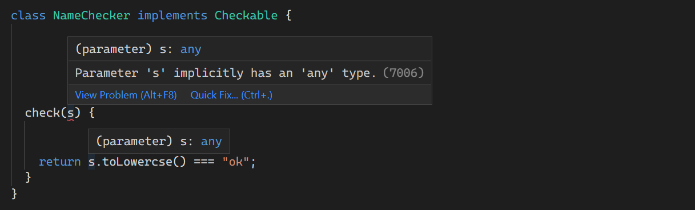
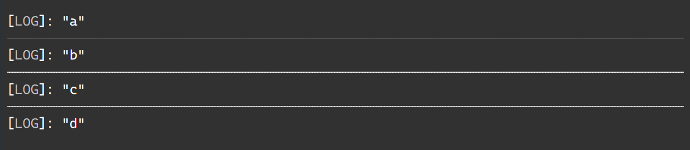
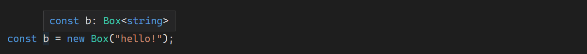
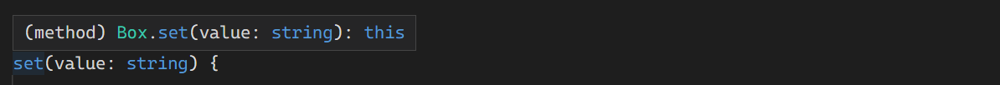
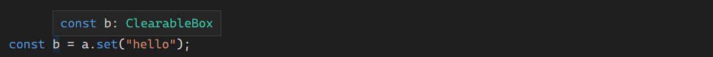
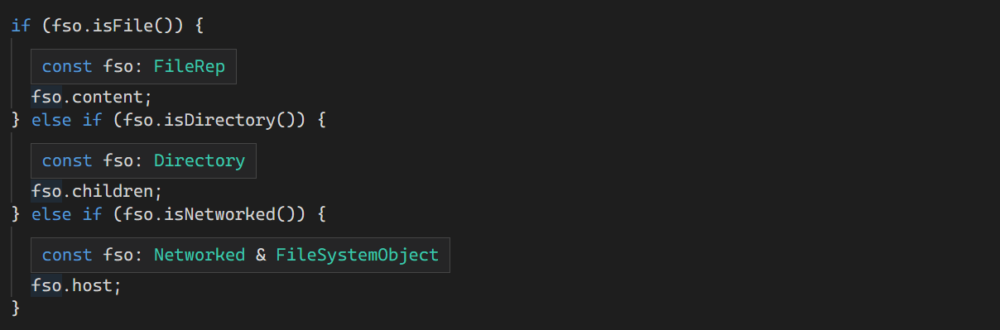
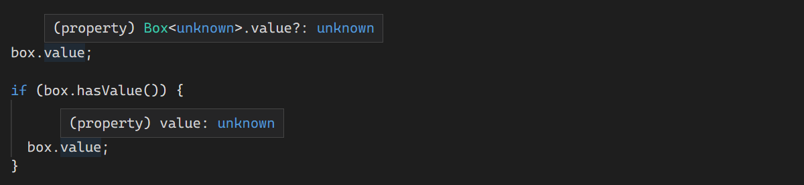
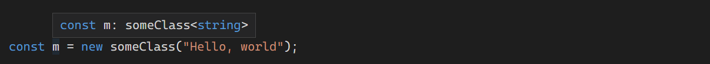

# 클래스

11주차에는 Handbook의 Classes 내용을 학습했습니다.

타입스크립트는 ES2015에 도입된 클래스 키워드를 완벽하게 지원합니다.

<br>

## 클래스 맴버

빈 클래스:

```tsx
class Point {}
```

### **필드**

쓰기 가능한 공용 속성을 만들 수 있다.

```tsx
class Point {
  x: number;
  y: number;
}

const pt = new Point();
pt.x = 0;
pt.y = 0;
```

임의의 값으로 미리 초기화할 수 있다.

```tsx
class Point {
  x = 0;
  y = 0;
}
 
const pt = new Point();
// Prints 0, 0
console.log(`${pt.x}, ${pt.y}`);
```

클래스의 속성이 초기화된 값으로 해당 타입을 추론한다.

```tsx
const pt = new Point();
pt.x = "0";
Type 'string' is not assignable to type 'number'.
```

#### --strictPropertyInitialization

strictPropertyInitialization 옵션은 생성자에서 클래스의 필드를 초기화해야 하는지 여부를 제어한다.

오류:

```tsx
class BadGreeter {
  name: string;
Property 'name' has no initializer and is not definitely assigned in the constructor.
}
```

오류없음:

```tsx
class GoodGreeter {
  name: string;

  constructor() {
    this.name = "hello";
  }
}
```

필드 초기화는 생성자 자체에서 해야한다. 타입스크립트에서 생성자 내부에서 다른 매서드를 호출해서 필드를 초기화하더라도 해당 필드의 초기화를 인정하지 않는다. 메서드를 재정의하고 맴버를 초기화하지 못할 수도 있기 때문이다.

만일 생성자가 아닌 다른 방법으로 초기화되는 것이 확실한 경우 변수 이름 뒤에 `!` 를 붙여 확정적으로 할당됨을 표시할 수 있다.

```tsx
class OKGreeter {
  name!: string;
}
```

### **readonly**

필드에 `readonly` 수식어를 붙일 수 있다.

```tsx
class Greeter {
  readonly name: string = "world";
 
  constructor(otherName?: string) {
    if (otherName !== undefined) {
      this.name = otherName;
    }
  }
 
  err() {
    this.name = "not ok";
Cannot assign to 'name' because it is a read-only property.
  }
}
const g = new Greeter();
g.name = "also not ok";
Cannot assign to 'name' because it is a read-only property.
```

### 생성자

클래스 생성자는 함수와 매우 유사하다. 타입

```tsx
class Point {
  x: number;
  y: number;

  constructor(x = 0, y = 0) {
    this.x = x;
    this.y = y;
  }
}
```

```tsx
class Point {

  constructor(x: number, y: string);
  constructor(s: string);
  constructor(xs: any, y?: any) {

  }
}
```

클래스의 생성자 시그니처와 함수의 시그니처 사이에 몇가지 차이점이 있다.

- 생성자는 타입 매개변수를 가질 수 없다.
- 생성자는 반환타입을 가질수 없다. 항상 클래스의 인스턴스를 반환한다.

#### super 호출

베이스 클래스가 있는 경우 이를 사용하기 전에 생성자 본문에서 `super()` 를 호출해야 한다.

```tsx
class Base {
  k = 4;
}
 
class Derived extends Base {
  constructor() {
    // Prints a wrong value in ES5; throws exception in ES6
    console.log(this.k);
'super' must be called before accessing 'this' in the constructor of a derived class.
    super();
  }
}
```

### 메서드

클래스의 함수 속성을 매서드라고 부른다. 메서드는 함수 및 생성자로 동일한 타입 표현을 사용할 수 있다.

```tsx
class Point {
  x = 10;
  y = 10;
 
  scale(n: number): void {
    this.x *= n;
    this.y *= n;
  }
}
```

메서드에서 클래스의 다른 속성에 접근하려면 항상 `this.` 를 사용해야한다.

```tsx
let x: number = 0;
 
class C {
  x: string = "hello";
 
  m() {
    // 1번 라인의 'x'를 수정한다. 클래스 'C'의 'x'가 아니다.
    x = "world";
Type 'string' is not assignable to type 'number'.
  }
}
```

### Getters / Setters

클래스의 다음과 같은 접근자가 있을 수 있다.

```tsx
class C {
  _length = 0;
  get length() {
    return this._length;
  }
  set length(value) {
    this._length = value;
  }
}
```

어떤 필드를 get/set 할 때 논리가 필요한 경우 get/set 을 사용해 표현해도 되지만, 논리가 필요 없는 경우 공용 필드로 표시하는 것이 좋다.

타입스크립트에는 접근자를 위한 몇 가지 특별한 추론 규칙이 있다.

- `get` 이 존재하지만, `set` 이 없는 경우 속성은 자동으로 읽기 전용이 된다.
- setter 매개 변수의 타입이 지정되지 않은 경우 getter의 반환 타입에서 유추된다.
- getter 와 setter는 맴버 가시성이 동일해야 한다.

하지만 타입스크립트 4.3 이후부터 가져오가나 설정할 때 서로 다른 타입의 접근자를 사용할 수 있게 되었다.

```tsx
class Thing {
  _size = 0;

  get size(): number {
    return this._size;
  }

  set size(value: string | number | boolean) {
    let num = Number(value);

    // NaN, Infinity, 등을 허용하지 않는다.

    if (!Number.isFinite(num)) {
      this._size = 0;
      return;
    }

    this._size = num;
  }
}
```

### 인덱스 시그니처

클래스는 인덱스 시그니처를 선언할 수 있다. 이러한 클래스는 다른 객체 타입에 대한 인덱스 서명과 동일하게 작동한다.

```tsx
class MyClass {
  [s: string]: boolean | ((s: string) => boolean);

  check(s: string) {
    return this[s] as boolean;
  }
}
```

인덱스 서명 타입은 메서드 타입도 캡처해야 하므로 이러한 타입을 유용하게 사용하는 것은 쉽지 않다. 일반적으로 인덱스 데이터는 클래스 인스턴스 자체보다는 다른 위치에 저장하는 것이 좋다.

<br>

## 클래스 유산(Class Heritage)

객체 지향 기능을 가진 다른 언어들처럼 자바스크립트의 클래스는 베이스 클래스에서 상속받을 수 있다.

### `implements`

`implements` 를 사용하여 클래스가 특정 인터페이스를 충족하는지 확인할 수 있다. 클래스가 올바르게 구현하지 못하면 오류가 발생한다.

```tsx
interface Pingable {
  ping(): void;
}
 
class Sonar implements Pingable {
  ping() {
    console.log("ping!");
  }
}
 
class Ball implements Pingable {
Class 'Ball' incorrectly implements interface 'Pingable'.
  Property 'ping' is missing in type 'Ball' but required in type 'Pingable'.
  pong() {
    console.log("pong!");
  }
}
```

또한 클래스는 여러 인터페이스를 구현할 수 있다. `class C implements A, B {`ㅈ

#### 주의사항

`implements` 는 클래스를 인터페이스 타입으로 취급하는 검사일 뿐이다. 클래스의 타입이나 메서드는 전혀 변경하지 않는다. 일반적인 오류의 원인은 `implements` 가 클래스의 타입을 변경한다고 가정하는 것이다.

```tsx
interface Checkable {
  check(name: string): boolean;
}
 
class NameChecker implements Checkable {
  check(s) {
Parameter 's' implicitly has an 'any' type.
    // 아래는 오류가 없다.
    return s.toLowercse() === "ok"; // s는 any 타입
  }
}
```



인터페이스 `Checkable` 에서 `check` 를 정의한 것처럼, 클래스 `NameChecker` 에서 같은 `check` 도 같을 것이라고 기대했지만, 결과는 그렇지 못했다.

마찬가지로 선택적 속성을 가진 인터페이스를 구현한다고 해서 해당 속성이 생성되지는 않는다.

```tsx
interface A {
  x: number;
  y?: number;
}
class C implements A {
  x = 0;
}
const c = new C();
c.y = 10;
Property 'y' does not exist on type 'C'.
```

즉, `implements` 는 단순한 타입 검사일 뿐이다.

### **`extends`**

클래스는 베이스 클래스에서 확장할 수 있다. 파생 클래스는 베이스 클래스의 모든 속성과 메서드를 가지며 추가 맴버도 정의한다.

```tsx
class Animal {
  move() {
    console.log("Moving along!");
  }
}

class Dog extends Animal {
  woof(times: number) {
    for (let i = 0; i < times; i++) {
      console.log("woof!");
    }
  }
}

const d = new Dog();
// Base class method
d.move();
// Derived class method
d.woof(3);
```

#### 오버라이딩 매서드

파생 클래스는 베이스 클래스의 필드 또는 속성을 재정의할 수도 있다. `super.` 구문을 사용하여 베이스 클래스 메서드에 액세스할 수 있다.

타입스크립트는 항상 파생 클래스가 베이스 클래스의 하위 타입으로 생각한다.

다음의 예시를 보자.

```tsx
class Base {
  greet() {
    console.log("Hello, world!");
  }
}

class Derived extends Base {
  greet(name?: string) {
    if (name === undefined) {
      super.greet();
    } else {
      console.log(`Hello, ${name.toUpperCase()}`);
    }
  }
}

const d = new Derived();
d.greet();
d.greet("reader");
```

베이스 클래스 참조를 통해서 파생 클래스의 인스턴스를 참조하는 것은 매우 일반적이며 항상 합법적이다.

```tsx
// 베이스 클래스 참조를 통해 파생된 인스턴스 별칭 지정
const b: Base = d;
// 문재 없다.
b.greet();
```

만약 `Derived` 가 `Base` 를 따르지 않았을 경우, 다음과 같다.

```tsx
class Base {
  greet() {
    console.log("Hello, world!");
  }
}
 
class Derived extends Base {
  // Make this parameter required
  greet(name: string) {
Property 'greet' in type 'Derived' is not assignable to the same property in base type 'Base'.
  Type '(name: string) => void' is not assignable to type '() => void'.
    console.log(`Hello, ${name.toUpperCase()}`);
  }
}
```

```tsx
const b: Base = new Derived();
// "name" 이 정의되지 않어서 충돌을 일으킬 것이다.
b.greet();
```

#### 타입 전용 필드 생성

타겟이 ES2022 이상이거나 useDefineForClassFields 옵션이 설정되어 있을 경우, 클래스 필드는 부모 클래스 생성자가 완료된 후 초기화되어 부모 클래스에서 설정한 값을 덮어쓴다. 이 문제는 상속된 필드에 대해 더 정확한 타입만 다시 선언하려는 경우에만 발생할 수 있다. 이런 경우를 처리하기 위해 해당 필드를 선언할 때 런타임 효과가 없어야 함을 나타내는 `declare` 를 작성할 수 있습니다.

```tsx
interface Animal {
  dateOfBirth: any;
}

interface Dog extends Animal {
  breed: any;
}

class AnimalHouse {
  resident: Animal;
  constructor(animal: Animal) {
    this.resident = animal;
  }
}

class DogHouse extends AnimalHouse {
  // 자바스크립트 코드를 내보내지 않지만,
  // 항상 타입이 올바른지 확인한다.
  declare resident: Dog;
  constructor(dog: Dog) {
    super(dog);
  }
}
```

#### 초기화 순서

다음을 먼저 살펴보자.

```tsx
class Base {
  name = "base";
  constructor() {
    console.log("My name is " + this.name);
  }
}

class Derived extends Base {
  name = "derived";
}

// "base"를 출력한다. "derived"가 아니다.
const d = new Derived();
```

자바스크립트의 클래스 초기화 순서는 다음과 같다.

1. 베이스 클래스 필드가 초기화
2. 베이스 클래스 생성자 실행
3. 파생 클래스 필드 초기화
4. 파생 클래스 생성자 실행

다음의 예시도 한번 살펴보자.

```tsx
class A {
  name = "a";
  constructor() {
    console.log(this.name);
   }
}
class B extends A {
  name = "b";
  constructor() { 
    super();
    console.log(this.name);
  }
}
class C extends B {
  name = "c";
  constructor() {
    super();
    console.log(this.name);
  }
}

class D extends C{
  name = "d";
  constructor() { 
    super();
    console.log(this.name);
  }
}

const d = new D();
```



최상위 베이스 클래스인 `A` 를 가장 먼저 초기화한 다음 `B` , `C` , 그리고 마지막인 `D` 를 초기화하는 것을 확인할 수 있다.

#### 상속가능한 기본 제공 타입

ES2015에서 객체를 반환하는 생성자는 `super(...)` 의 호출자를 암시적으로 `this` 의 값으로 대체한다. 생성된 생성자 코드가 `super(...)` 의 잠재적인 반환 값을 캡처하고 `this` 로 대체해야 한다.

따라서 오류, 배열 등의 하위 분류가 예상대로 작동하지 않을 수 있다. 이는 `Error` , `Array` 등의 생성자 함수가 ECMAScript 6의 `[new.target](http://new.target)` 을 사용하여 프로토타입 체인을 조정하기 때문이다. 그러나 ECMAScript 5에서 생성자를 호출할 때 `new.target` 의 값을 보장할 수 있는 방법은 없다. 다른 하위 수준 컴파일러도 기본적으로 동일한 제한이 있다.

```tsx
class MsgError extends Error {
  constructor(m: string) {
    super(m);
  }
  sayHello() {
    return "hello " + this.message;
  }
}
```

위의 예시에서 다음 사항을 확인할 수 있다.

- 메서드가 이런 하위 클래스를 구성하여 반환된 개체에 정의되지 않을 수 있으므로 `sayHello` 를 호출하면 오류가 발생한다.
- `instanceof` 가 하위 클래스의 인스턴스와 해당 인스턴스 사이에서 고장나게 되므로 `(new MsgError()) instanceof MsgError` 가 `false` 를 반환한다.

`super(...)` 호출 후 즉시 프로토타입을 수동으로 조정하는 것이 좋다.

```tsx
class MsgError extends Error {
  constructor(m: string) {
    super(m);

    // 프로토타입을 명시적으로 설정
    Object.setPrototypeOf(this, MsgError.prototype);
  }

  sayHello() {
    return "hello " + this.message;
  }
}
```

하지만 이런 경우 `MsgError` 의 모든 하위 클래스는 프로토타입을 수동으로 설정해야 한다. `Object.setPrototypeOf()` 를 지원하지 않는 런타임의 경우, `__proto__`를 대신 사용할 수 있다.

불행히도 이 해결 방법은 Internet Explorer 10 이전 버전에서는 작동하지 않는다.

<br>

## 맴버 가시성

타입스크립트를 사용하여 특정 메서드나 속성이 클래스 외부에 노출할 지를 제어할 수 있다.****

### **`public`**

클래스 맴버의 기본 가시성은 `public` 이다. `public` 은 모든 장소에서 접근할 수 있다.

```tsx
class Greeter {
  public greet() {
    console.log("hi!");
  }
}
const g = new Greeter();
g.greet();
```

`public` 은 이미 기본 가시성이므로 클래스 맴버에 직접 쓸 필요는 없지만, 스타일/가독성의 이유로 작성할 수 있다.

### `protected`

`protected` 맴버는 선언된 클래스의 하위 클래스에만 표시됩니다.

```tsx
class Greeter {
  public greet() {
    console.log("Hello, " + this.getName());
  }
  protected getName() {
    return "hi";
  }
}
 
class SpecialGreeter extends Greeter {
  public howdy() {
    // 여기서 protected 맴버에 접근할 수 있다.
    console.log("Howdy, " + this.getName());
  }
}
const g = new SpecialGreeter();
g.greet(); // 가능
g.getName();
Property 'getName' is protected and only accessible within class 'Greeter' and its subclasses.
```

#### `protected` 맴버 노출

파생 클래스는 기본 클래스를 따라야 하지만, 더 많은 기능을 가진 하위 타입의 기본 클래스를 노출하도록 선택할 수 있다. 여기에는 `protected` 맴버를 `public` 으로 바꾸는 것이 포함된다.

```tsx
class Base {
  protected m = 10;
}
class Derived extends Base {
  // 수식어가 없으므로 기본값인 public 이다.
  m = 15;
}
const d = new Derived();
console.log(d.m); // 가능
```

`Derived` 는 이미 자유롭게 `m`을 읽고 쓸 수 있었기 때문에 이 상황의 "보안"을 의미 있게 변경하지 않는다. 만일 파생 클래스에서 노출되는 게 의도힌 것이 아니라면 `protected` 수식어를 반복해서 작성해야 한다는 것이다.

#### 계층 간 `protected` 접근

베이스 클래스 참조를 통해 `protected` 멤버에 접근하는 것이 합법적인지에 대해 객체지향 언어마다 다르다.

```tsx
class Base {
  protected x: number = 1;
}
class Derived1 extends Base {
  protected x: number = 5;
}
class Derived2 extends Base {
  f1(other: Derived2) {
    other.x = 10;
  }
  f2(other: Base) {
    other.x = 10;
Property 'x' is protected and only accessible through an instance of class 'Derived2'. This is an instance of class 'Base'.
  }
}
```

자바는 위의 예시가 합법, C#과 C++은 불법으로 생각한다.

여기서 타입스크립트는 C#과 C++처럼 처리한다. `protected` 에 접근할 수 있는 건 오직 클래스 자신의 내부 속성만으로 한정된다.

### `private`

`private` 는 `protected` 와 비슷하지만, 하위 클래스에서도 맴버의 대한 접근을 허용하지 않는다.

```tsx
class Base {
  private x = 0;
}
const b = new Base();
// Can't access from outside the class
console.log(b.x);
Property 'x' is private and only accessible within class 'Base'.
```

```tsx
class Derived extends Base {
  showX() {
    // Can't access in subclasses
    console.log(this.x);
Property 'x' is private and only accessible within class 'Base'.
  }
}
```

`private` 맴버는 파생 클래스에 보이지 않기 때문에 파생 클래스는 가시성을 바꿀 수 없다.

```tsx
class Base {
  private x = 0;
}
class Derived extends Base {
Class 'Derived' incorrectly extends base class 'Base'.
  Property 'x' is private in type 'Base' but not in type 'Derived'.
  x = 1;
}
```

#### 계층 간 `private` 접근

객체지향 언어마다 같은 클래스의 다른 인스턴스가 각자의 `private` 맴버에 액세스하는 방법이 다르다. 자바, C#, C++, Swift, PHP와 같은 언어들은 이것을 허용하지만, 루비는 그렇지 않다.

타입스크립트는 인스턴스 간 `private` 접근을 허용한다.

```tsx
class A {
  private x = 10;
 
  public sameAs(other: A) {
    // 오류 없음
    return other.x === this.x;
  }
}
```

#### 주의사항

타입스크립트의 다른 타입 시스템과 마찬가지로, `private` 및 `protected` 는 타입 검사 중에만 적용된다.

즉, `in` 또는 단순 속성 룩업과 같은 자바스크립트 런타임 구조는 여전히 `private` 및 `protected` 멤버에 접근할 수 있다.

```tsx
class MySafe {
  private secretKey = 12345;
}
```

```tsx
// 자바스크립트 파일에서
const s = new MySafe();
// '12345'를 출력한다.
console.log(s.secretKey);
```

또한 `private` 는 타입 검사 중에 대괄호 표기법을 사용하여 접근할 수 있다. 이렇게 하면 장치 테스트와 같은 경우 `private` 필드를 잠재적으로 더 쉽게 접근할 수 있게 되는데, 이러한 필드는 개인 정보를 엄격하게 적용하지 않는다는 단점이 있다.

```tsx
class MySafe {
  private secretKey = 12345;
}
 
const s = new MySafe();
 
// 타입 검사 중에는 허용되지 않는다.
console.log(s.secretKey);
Property 'secretKey' is private and only accessible within class 'MySafe'.
 
// 가능하다.
console.log(s["secretKey"]);
```

타입스크립트의 `private` 과는 달리 자바스크립트의 `private` 필드(#)는 컴파일 후에도 `private` 이 유지되며, 대괄호 표기법 접근과 같은 앞서 언급한 방법을 제공하지 않아서 강하게 `private` 을 유지할 수 있다.

```tsx
class Dog {
  #barkAmount = 0;
  personality = "happy";
 
  constructor() {}
}
```

```jsx
"use strict";
class Dog {
    constructor() {
        this.#barkAmount = 0;
        this.personality = "happy";
    }
    #barkAmount;
}
```

ES2021 이하로 컴파일할 때는 `#` 대신  `WeakMap` 을 사용한다.

```jsx
"use strict";
var _Dog_barkAmount;
class Dog {
    constructor() {
        _Dog_barkAmount.set(this, 0);
        this.personality = "happy";
    }
}
_Dog_barkAmount = new WeakMap();
```

악의적인 행위자로부터 클래스의 값을 보호해야 하는 경우 closures, WeakMaps 또는 private 필드와 같은 하드 런타임 프라이버시를 제공하는 메커니즘을 사용해야 한다. 런타임 중에 이렇게 추가된 프라이버시 검사는 성능에 영향을 줄 수 있다.

<br>

## 정적 맴버

클래스에 정적 멤버가 있을 수 있다. 이 맴버는 클래스의 특정 인스턴스와 연결되어 있지 않고, 클래스 생성자 개체를 통해 액세스할 수 있다.

```tsx
class MyClass {
  static x = 0;
  static printX() {
    console.log(MyClass.x);
  }
}
console.log(MyClass.x);
MyClass.printX();
```

정적 맴버는 동일한 `public` , `protected` , `private` 수정자를 사용할 수도 있다.

```tsx
class MyClass {
  private static x = 0;
}
console.log(MyClass.x);
Property 'x' is private and only accessible within class 'MyClass'.
```

정적 맴버도 상속된다.

```tsx
class Base {
  static getGreeting() {
    return "Hello world";
  }
}
class Derived extends Base {
  myGreeting = Derived.getGreeting();
}
```

### 특수 정적 이름

클래스는 그 자체가 새로운 이름으로 호출될 수 있는 함수이기 때문에 특정 정적 이름을 사용할 수 없다. `name`, `length` 등과 같은 미리 정의된 함수 속성은 정적 멤버로 정의할 수 없다.

```tsx
class S {
  static name = "S!";
Static property 'name' conflicts with built-in property 'Function.name' of constructor function 'S'.
}
```

### 정적 클래스가 없는 이유

타입스크립트(및 자바스크립트)에는 C#과 같은 `static class` 라는 구조체가 없다.

이러한 구조는 언어가 모든 데이터와 함수를 클래스 내에 포함하도록 강제하기 때문에 존재할 뿐이며, 타입스크립트에는 이러한 제한이 없기 때문에 필요하지 않다. 단일 인스턴스만 있는 클래스는 일반적으로 자바스크립트/타입스크립트에서 일반 객체로 표시된다.

다음의 예시에서 알 수 있듯이, 일반 객체(또는 최상위 함수)는 다음과 같은 작업을 수행하기 때문에 타입스크립트에서 "정적 클래스" 구문은 필요하지 않습니다.

```tsx
// 불필요한 "static" class
class MyStaticClass {
  static doSomething() {}
}
 
// 선호되는 (대안 1)
function doSomething() {}
 
// 선호되는 (대안 2)
const MyHelperObject = {
  dosomething() {},
};
```

<br>

## 클래스의 `static` 블럭

정적 블록을 사용하면 포함된 클래스 내의 개인 필드에 액세스할 수 있는 자체 범위를 사용하여 일련의 구문을 작성할 수 있다.

```tsx
class Foo {
    static #count = 0;

    get count() {
        return Foo.#count;
    }

    static {
        try {
            const lastInstances = loadLastInstances();
            Foo.#count += lastInstances.length;
        }
        catch {}
    }
}
```

<br>

## 제네릭 클래스

클래스는 인터페이스와 마찬가지로 제네릭을 사용할 수 있다. 제네릭 클래스가 `new` 로 인스턴스화될 때 해당 타입 매개 변수는 함수 호출에서와 같은 방식으로 유추됩니다.

```tsx
class Box<Type> {
  contents: Type;
  constructor(value: Type) {
    this.contents = value;
  }
}

const b = new Box("hello!");
```



클래스는 인터페이스와 동일한 방식으로 제네릭 제약 조건과 기본값을 사용할 수 있다.

### 정적 맴버의 타입 매개 변수

타입은 항상 완전하게 지워지기 때문에 제네릭 클래스의 `static` 맴버는 타입 매개변수를 참조할 수 없다.

```tsx
class Box<Type> {
  static defaultValue: Type;
Static members cannot reference class type parameters.
}
```

<br>

## 클래스의 런타임에서 `this`

타입스크립트는 자바스크립트의 런타임 동작을 변경하지 않으며, 자바스크립트는 몇 가지 특이한 런타임 동작을 갖는다.

```tsx
class MyClass {
  name = "MyClass";
  getName() {
    return this.name;
  }
}
const c = new MyClass();
const obj = {
  name: "obj",
  getName: c.getName,
};
 
// "MyClass"가 아닌 "obj"를 출력한다.
console.log(obj.getName());
```

간단히 말해서, 기본적으로 함수 내부의 `this` 값은 함수의 호출 방식에 따라 달라집니다. 위 예제에서 함수는 `obj` 참조를 통해 호출되었기 때문에 `this` 함수의 값은 클래스 인스턴스가 아닌 `obj` 이다.

타입스크립트는 이러한 종류의 오류를 완화하거나 방지하는 몇 가지 방법을 제공합니다.

### 화살표 함수

만약 당신이 종종 그것의 'this' 컨텍스트를 잃는 방식으로 호출되는 함수를 가지고 있다면, 메서드 정의 대신 화살표 함수 속성을 사용하는 것이 좋다.

```tsx
class MyClass {
  name = "MyClass";
  getName = () => {
    return this.name;
  };
}
const c = new MyClass();
const g = c.getName;
// 충돌 대신 "MyClass" 출력
console.log(g());
```

여기에는 몇 가지 장단점이 있다.

- `this` 값은 타입스크립트로 확인되지 않은 코드의 경우에도 런타임에 정확하다.
- 각 클래스 인스턴스는 이러한 방식으로 정의된 각 함수의 자체 복사본을 가질 것이기 때문에 더 많은 메모리를 사용할 것이다.
- 프로토타입 체인에 베이스 클래스 메서드를 가져올 항목이 없으므로 파생 클래스에서 `super.getName` 을 사용할 수 없습니다.

### `this` 매개변수

메서드 또는 함수 정의에서 `this` 이름의 초기 매개 변수는 타입스크립트에서 특별한 의미를 가진다. 다음 파라미터는 컴파일 중에 지워진다.

```tsx
// 타입스크립트 입력: 'this' 매개변수가 있는
function fn(this: SomeType, x: number) {
  /* ... */
}
```

```jsx
// 자바스크립트 출력
function fn(x) {
  /* ... */
}
```

타입스크립트는 `this` 매개 변수를 사용하여 함수를 호출하는 것이 올바른 컨텍스트에서 수행되는지 확인한다. 화살표 함수를 사용하는 대신 메서드 정의에 `this` 매개 변수를 추가하여 메서드가 올바르게 호출되었는지 정적으로 적용할 수 있다.

```tsx
class MyClass {
  name = "MyClass";
  getName(this: MyClass) {
    return this.name;
  }
}
const c = new MyClass();
// OK
c.getName();
 
// Error, would crash
const g = c.getName;
console.log(g());
The 'this' context of type 'void' is not assignable to method's 'this' of type 'MyClass'.
```

이 방법은 화살표 함수 접근 방식과 반대의 장단점을 만든다.

- 자바스크립트 호출자는 여전히 클래스 메서드를 인식하지 못하고 잘못 사용할 수 있다.
- 클래스를 정의할 때마다 하나의 함수만 할당되며, 클래스 인스턴스당 하나의 함수만 할당된다.
- 베에스 메서드 정의는 여전히 `super` 를 통해 호출할 수 있습니다.

### `this` 타입

클래스에서 'this'라는 특수 타입은 현재 클래스의 타입을 동적으로 참조합니다.

```tsx
class Box {
  contents: string = "";
  set(value: string) {
    this.contents = value;
    return this;
  }
}
```



여기서 타입스크립트는 집합의 반환 타입을 `Box` 가 아닌 `this` 타입으로 추론했다. 이제 `Box` 의 하위 클래스를 만들어 보자.

```tsx
class ClearableBox extends Box {
  clear() {
    this.contents = "";
  }
}

const a = new ClearableBox();
const b = a.set("hello");
```



매개변수에서도 `this` 타입을 사용할 수 있다.

```tsx
class Box {
  content: string = "";
  sameAs(other: this) {
    return other.content === this.content;
  }
}
```

이 방법은 `other: Box` 를 작성하는 것과 다르다. 파생 클래스가 있는 경우 `sameAs` 메서드는 이제 동일한 파생 클래스의 다른 인스턴스만 허용된다.

```tsx
class Box {
  content: string = "";
  sameAs(other: this) {
    return other.content === this.content;
  }
}
 
class DerivedBox extends Box {
  otherContent: string = "?";
}
 
const base = new Box();
const derived = new DerivedBox();
derived.sameAs(base);
Argument of type 'Box' is not assignable to parameter of type 'DerivedBox'.
  Property 'otherContent' is missing in type 'Box' but required in type 'DerivedBox'.
```

### `this` 기반 타입 가드

클래스 및 인터페이스의 메서드에 대해 반환 위치에서 `This is Type` 을 사용할 수 있다. 좁혀지는 타입(예: `if` 문)과 혼합될 경우 대상 객체의 타입은 지정된 `Type` 으로 좁혀진다.

```tsx
class FileSystemObject {
  isFile(): this is FileRep {
    return this instanceof FileRep;
  }
  isDirectory(): this is Directory {
    return this instanceof Directory;
  }
  isNetworked(): this is Networked & this {
    return this.networked;
  }
  constructor(public path: string, private networked: boolean) {}
}

class FileRep extends FileSystemObject {
  constructor(path: string, public content: string) {
    super(path, false);
  }
}

class Directory extends FileSystemObject {
  children: FileSystemObject[];
}

interface Networked {
  host: string;
}

const fso: FileSystemObject = new FileRep("foo/bar.txt", "foo");

if (fso.isFile()) {
  fso.content;
} else if (fso.isDirectory()) {
  fso.children;
} else if (fso.isNetworked()) {
  fso.host;
}
```



this 기반 타입 가드의 일반적인 사용 사례는 특정 필드의 지연 유효성 검사를 허용하는 것이다. 예를 들어, 이 경우 `hasValue` 가 참인 것으로 확인되면 상자 안에 있는 값에서 `undefined` 를 제거한다.

```tsx
class Box<T> {
  value?: T;

  hasValue(): this is { value: T } {
    return this.value !== undefined;
  }
}

const box = new Box();
box.value = "Gameboy";

box.value;

if (box.hasValue()) {
  box.value;
}
```



### 매개변수 속성

타입스크립트는 생성자 매개변수를 동일한 이름과 값을 가진 클래스 속성으로 변환하기 위한 특수 구문을 제공한다. 매개변수 속성이라고 하며, 생성자 인수에 `public` , `private` , `protected` , 또는 `readonly` 라는 가시성 수식자 중 하나를 붙여 만든다. 결과 필드는 다음의 한정자를 가져온다.

```tsx
class Params {
  constructor(
    public readonly x: number,
    protected y: number,
    private z: number
  ) {
    // 구현할 필요 없다.
  }
}
const a = new Params(1, 2, 3);
console.log(a.x);  // (property) Params.x: number
console.log(a.z); 
Property 'z' is private and only accessible within class 'Params'.
```

<br>

## 클래스 표현식

클래스 표현식은 클래스 선언과 매우 유사하다. 유일한 차이점은 클래스 표현식에는 이름이 필요하지 않다는 것이다.

```tsx
const someClass = class<Type> {
  content: Type;
  constructor(value: Type) {
    this.content = value;
  }
};

const m = new someClass("Hello, world");
```



## **`abstract` 클래스와 맴버**

타입스크립트의 클래스, 메서드 및 필드는 추상적일 수 있다.

추상 메서드 또는 추상 필드는 구현이 제공되지 않은 필드다. 이런 맴버는 직접 인스턴스화할 수 없는 추상 클래스 내에 존재해야 한다.

추상 클래스의 역할은 모든 추상 멤버를 구현하는 하위 클래스의 베이스 클래스 역할을 하는 것이다. 클래스에 추상적인 맴버가 없을 때, 그것을 구체적이라고 한다.

다음의 예시를 보자.

```tsx
abstract class Base {
  abstract getName(): string;
 
  printName() {
    console.log("Hello, " + this.getName());
  }
}
 
const b = new Base();
Cannot create an instance of an abstract class.
```

`Base` 는 추상적이기 때문에 `new` 로 인스턴스화할 수 없다. 대신 파생 클래스를 만들고 추상 멤버를 구현해야 한다.

```tsx
class Derived extends Base {
  getName() {
    return "world";
  }
}

const d = new Derived();
d.printName();
```

베이스 클래스의 추상 멤버를 구현하는 것을 잊으면 오류가 발생합니다.

```tsx
class Derived extends Base {
Non-abstract class 'Derived' does not implement inherited abstract member 'getName' from class 'Base'.
}
```

### 추상 구성 시그니처

때때로 일부 추상 클래스에서 파생된 클래스의 인스턴스를 생성하는 일부 클래스 생성자 함수를 허용하려고 한다.

예를 들어, 다음 코드를 작성할 수 있다.

```tsx
function greet(ctor: typeof Base) {
  const instance = new ctor();
Cannot create an instance of an abstract class.
  instance.printName();
}
```

타입스크립트가 추상 클래스를 인스턴스화하려고 한다는 것을 알려준다. 결국, `greet` 의 정의를 고려할 때, 이 코드를 작성하는 것은 완벽하게 합법적이며, 결국 추상 클래스를 구성할 것이다.

대신에 구성 시그니처를 사용하여 무언가를 허용하는 함수를 작성해보자.

```tsx
function greet(ctor: new () => Base) {
  const instance = new ctor();
  instance.printName();
}
greet(Derived);
greet(Base);
Argument of type 'typeof Base' is not assignable to parameter of type 'new () => Base'.
  Cannot assign an abstract constructor type to a non-abstract constructor type.
```

이제 타입스크립트는 어떤 클래스의 생성자 함수를 호출할 수 있는지 정확하게 알려준다. `Derived` 는 구체적이기 때문에 호출할 수 있지만, `Base` 는 호출할 수 없다.

<br>

## 클래스 간의 관계

대부분의 경우 타입스크립트의 클래스는 다른 타입과 동일하게 구조적으로 비교된다.

```tsx
class Point1 {
  x = 0;
  y = 0;
}

class Point2 {
  x = 0;
  y = 0;
}

// 가능
const p: Point1 = new Point2();
```

마찬가지로, 명시적 상속이 없는 경우에도 클래스 간의 하위 타입 관계가 존재합니다.

```tsx
class Person {
  name: string;
  age: number;
}

class Employee {
  name: string;
  age: number;
  salary: number;
}

// 가능
const p: Person = new Employee();
```

이것은 간단하지만, 다른 경우들보다 더 낮설게 보이는 경우가 몇 가지 있다.

빈 클래스에 맴버가 없다, 구조형 시스템에서 맴버가 없는 타입은 일반적으로 다른 어떤 것의 상위 타입이다. 따라서 빈 클래스를 작성하면 그 대신 모든 클래스를 사용할 수 있다.
